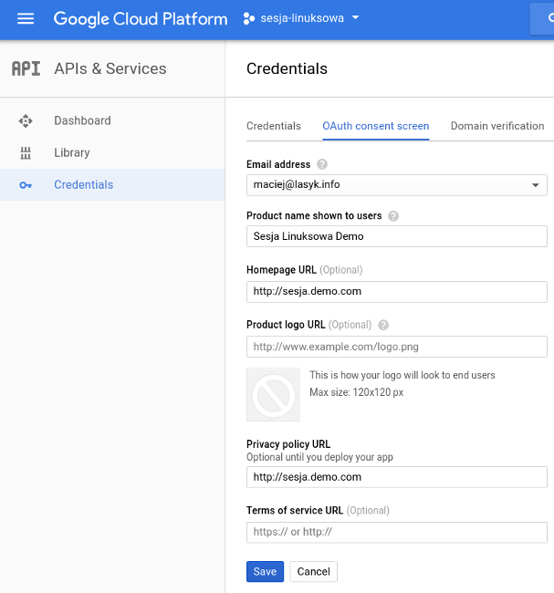
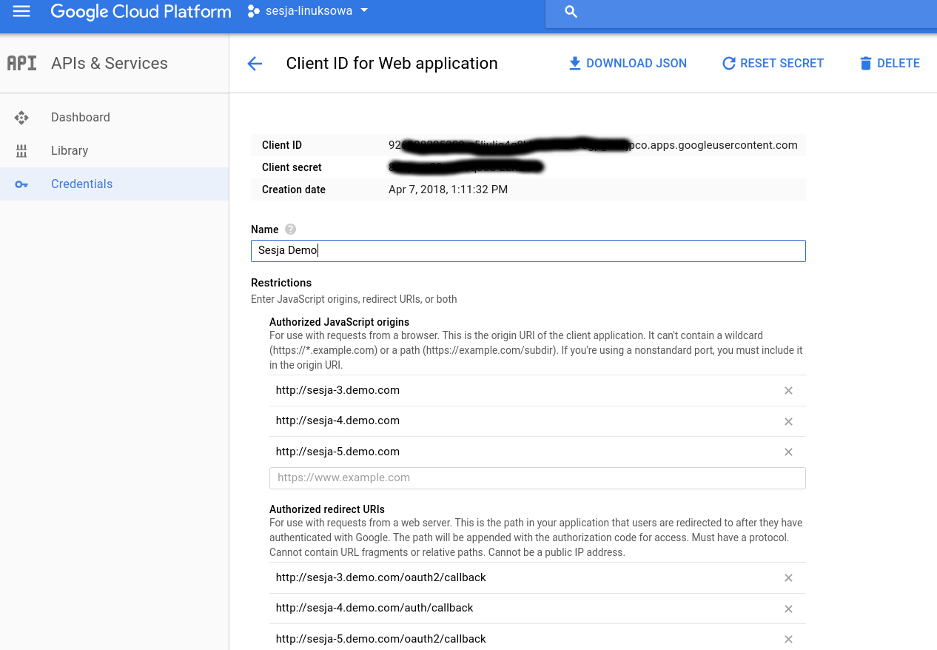
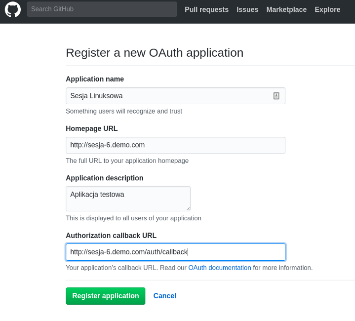
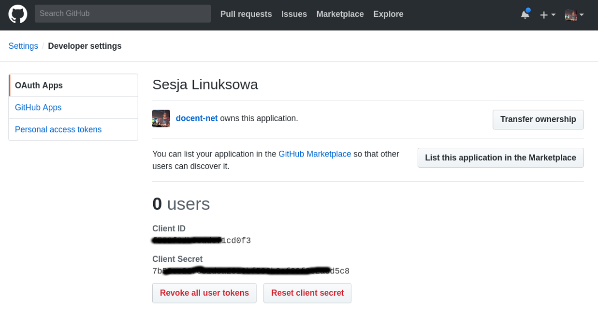

name: default
layout: true

class: center, middle
count: false
---
name: left
layout: true

class: left, middle
count: false
---
template: default


## Uwierzytelnienie i autoryzacja przy pomocy Oauth2, Nginxa i Pythona

### 15 Sesja Linuksowa

2018-04-08<br>
Maciej Lasyk

---
template: left

# agenda

- Dlaczego ta prezentacja?
- Jakie problemy chciałem rozwiązać?
- Uwierzytelnianie a autoryzacja
- Oauth & Oauth2
- 5 sposobów uwierzytelniania aka 5x demo

---
template: default

# Dlaczego ta prezentacja?

---
template: default

### Problemy, które chciałem rozwiązać

.left[.grey1[
- nieuwierzytelnione aplikacje
]]
.left[.grey1[
- zdecentralizowane uwierzytelnianie
]]
.left[.grey1[
- własne SSO jest ciężkie
]]
---
template: default

### Problemy, które chciałem rozwiązać

.left[.black[
- nieuwierzytelnione aplikacje
]]
.left[.grey1[
- zdecentralizowane uwierzytelnianie
]]
.left[.grey1[
- własne SSO jest ciężkie
]]
---
template: default

### Problemy, które chciałem rozwiązać

.left[.grey1[
- nieuwierzytelnione aplikacje
]]
.left[.black[
- zdecentralizowane uwierzytelnianie
]]
.left[.grey1[
- własne SSO jest ciężkie
]]
---
template: default

### Problemy, które chciałem rozwiązać

.left[.grey1[
- nieuwierzytelnione aplikacje
]]
.left[.grey1[
- zdecentralizowane uwierzytelnianie
]]
.left[.black[
- własne SSO jest ciężkie
]]
---
template: default

### Uwierzytelnianie a autoryzacja

.left[.grey1[
- różnice
]]
.left[.grey1[
- znane rozwiązania (LDAP, SAML, AD)
]]
.left[.grey1[
- własne SSO jest ciężkie
]]
---
template: default

### Uwierzytelnianie a autoryzacja

.left[.black[
- różnice
]]
.left[.grey1[
- znane rozwiązania (LDAP, SAML, AD)
]]
.left[.grey1[
- własne SSO jest ciężkie
]]

---
template: default

### Uwierzytelnianie a autoryzacja

.left[.grey1[
- różnice
]]
.left[.black[
- znane rozwiązania (LDAP, SAML, AD)
]]
.left[.grey1[
- własne SSO jest ciężkie
]]
---
template: default

### Uwierzytelnianie a autoryzacja

.left[.grey1[
- różnice
]]
.left[.grey1[
- znane rozwiązania (LDAP, SAML, AD)
]]
.left[.black[
- własne SSO jest ciężkie
]]

---
template: default

### Oauth2 a SSO

.left[
**Oauth:** Protokół uwierzytelniania, dzięki któremu użytkownik może wybierać, 
które serwisy mogą używać jakich jego danych i / lub zasobów [TM]
]

--

.left[
**SSO:** Koncept polegający na jednorazowym uwierzytelnieniu użytkownika i nadaniu mu
dostępu do jego zasobów przy użyciu tych samych danych logowania.
]

--

.center[
**Przy użyciu Oautha można zrealizować SSO**
]
---
template: default

### Oauth2


https://www.digitalocean.com/community/tutorials/an-introduction-to-oauth-2

---
template: default

### Oauth2

.left[.grey1[
- **Resource Owner**: Najczęściej klient (end-user), który chce się uwierzytelnić i uzyskać dostęp do zasobów oraz wykonać jakąś akcję na nich.
]]
.left[.grey1[
- **Client**: aplikacja pytająca w imieniu **Resource Ownera** o zasoby (requestuje o nie).
]]
.left[.grey1[
- **Resource Server**: Serwer hostujący zasoby, do których dostęp chce uzyskać **Resource Owner**. Może to być API serwer (najczęściej).
]]
.left[.grey1[
- **Authorization Server**: serwer uwierzytelniający **Resource Ownera** i nadający mu Access Token
]]

---
template: default

### Oauth2

.left[.black[
- **Resource Owner**: Najczęściej klient (end-user), który chce się uwierzytelnić i uzyskać dostęp do zasobów oraz wykonać jakąś akcję na nich.
]]
.left[.grey1[
- **Client**: aplikacja pytająca w imieniu **Resource Ownera** o zasoby (requestuje o nie).
]]
.left[.grey1[
- **Resource Server**: Serwer hostujący zasoby, do których dostęp chce uzyskać **Resource Owner**. Może to być API serwer (najczęściej).
]]
.left[.grey1[
- **Authorization Server**: serwer uwierzytelniający **Resource Ownera** i nadający mu Access Token
]]

---
template: default

### Oauth2

.left[.grey1[
- **Resource Owner**: Najczęściej klient (end-user), który chce się uwierzytelnić i uzyskać dostęp do zasobów oraz wykonać jakąś akcję na nich.
]]
.left[.black[
- **Client**: aplikacja pytająca w imieniu **Resource Ownera** o zasoby (requestuje o nie).
]]
.left[.grey1[
- **Resource Server**: Serwer hostujący zasoby, do których dostęp chce uzyskać **Resource Owner**. Może to być API serwer (najczęściej).
]]
.left[.grey1[
- **Authorization Server**: serwer uwierzytelniający **Resource Ownera** i nadający mu Access Token
]]

---
template: default

### Oauth2

.left[.grey1[
- **Resource Owner**: Najczęściej klient (end-user), który chce się uwierzytelnić i uzyskać dostęp do zasobów oraz wykonać jakąś akcję na nich.
]]
.left[.grey1[
- **Client**: aplikacja pytająca w imieniu **Resource Ownera** o zasoby (requestuje o nie).
]]
.left[.black[
- **Resource Server**: Serwer hostujący zasoby, do których dostęp chce uzyskać **Resource Owner**. Może to być API serwer (najczęściej).
]]
.left[.grey1[
- **Authorization Server**: serwer uwierzytelniający **Resource Ownera** i nadający mu Access Token
]]

---
template: default

### Oauth2

.left[.grey1[
- **Resource Owner**: Najczęściej klient (end-user), który chce się uwierzytelnić i uzyskać dostęp do zasobów oraz wykonać jakąś akcję na nich.
]]
.left[.grey1[
- **Client**: aplikacja pytająca w imieniu **Resource Ownera** o zasoby (requestuje o nie).
]]
.left[.grey1[
- **Resource Server**: Serwer hostujący zasoby, do których dostęp chce uzyskać **Resource Owner**. Może to być API serwer (najczęściej).
]]
.left[.black[
- **Authorization Server**: serwer uwierzytelniający **Resource Ownera** i nadający mu Access Token
]]

---
template: default

### Oauth2 vs Oauth

.left[.grey1[
- OAuth2 to zupełnie nowy protokół (brak kompatybilności wstecznej)
]]
.left[.grey1[
- Oauth2 powstał na skutek współpracy Yahoo!, Facebook, Salesforce, Microsoft, 
Twitter, Deutsche Telekom, Intuit, Mozilla, Google i kilku innych
]]
.left[.grey1[
- OAuth2 obsługuje flowy dla aplikacji mobilnych i nie - przeglądarkowych
]]
.left[.grey1[
- zniesiono HMAC (hash-based message authentication), wystarczy HTTPS i token
]]
.left[.grey1[
- uproszczone tokeny (bearer tokens)
]]
.left[.grey1[
- skrócono czas życia tokenów
]]
.left[.grey1[
- rozdzielono role serwera uwierzytelniania i obsługującego zapytania klienta (np API)
]]

---
template: default

### Oauth2 vs Oauth

.left[.black[
- OAuth2 to zupełnie nowy protokół (brak kompatybilności wstecznej)
]]
.left[.grey1[
- Oauth2 powstał na skutek współpracy Yahoo!, Facebook, Salesforce, Microsoft, 
Twitter, Deutsche Telekom, Intuit, Mozilla, Google i kilku innych
]]
.left[.grey1[
- OAuth2 obsługuje flowy dla aplikacji mobilnych i nie - przeglądarkowych
]]
.left[.grey1[
- zniesiono HMAC (hash-based message authentication), wystarczy HTTPS i token
]]
.left[.grey1[
- uproszczone tokeny (bearer tokens)
]]
.left[.grey1[
- skrócono czas życia tokenów
]]
.left[.grey1[
- rozdzielono role serwera uwierzytelniania i obsługującego zapytania klienta (np API)
]]
---
template: default

### Oauth2 vs Oauth

.left[.grey1[
- OAuth2 to zupełnie nowy protokół (brak kompatybilności wstecznej)
]]
.left[.black[
- Oauth2 powstał na skutek współpracy Yahoo!, Facebook, Salesforce, Microsoft, 
Twitter, Deutsche Telekom, Intuit, Mozilla, Google i kilku innych
]]
.left[.grey1[
- OAuth2 obsługuje flowy dla aplikacji mobilnych i nie - przeglądarkowych
]]
.left[.grey1[
- zniesiono HMAC (hash-based message authentication), wystarczy HTTPS i token
]]
.left[.grey1[
- uproszczone tokeny (bearer tokens)
]]
.left[.grey1[
- skrócono czas życia tokenów
]]
.left[.grey1[
- rozdzielono role serwera uwierzytelniania i obsługującego zapytania klienta (np API)
]]

---
template: default

### Oauth2 vs Oauth

.left[.grey1[
- OAuth2 to zupełnie nowy protokół (brak kompatybilności wstecznej)
]]
.left[.grey1[
- Oauth2 powstał na skutek współpracy Yahoo!, Facebook, Salesforce, Microsoft, 
Twitter, Deutsche Telekom, Intuit, Mozilla, Google i kilku innych
]]
.left[.black[
- OAuth2 obsługuje flowy dla aplikacji mobilnych i nie - przeglądarkowych
]]
.left[.grey1[
- zniesiono HMAC (hash-based message authentication), wystarczy HTTPS i token
]]
.left[.grey1[
- uproszczone tokeny (bearer tokens)
]]
.left[.grey1[
- skrócono czas życia tokenów
]]
.left[.grey1[
- rozdzielono role serwera uwierzytelniania i obsługującego zapytania klienta (np API)
]]

---
template: default

### Oauth2 vs Oauth

.left[.grey1[
- OAuth2 to zupełnie nowy protokół (brak kompatybilności wstecznej)
]]
.left[.grey1[
- Oauth2 powstał na skutek współpracy Yahoo!, Facebook, Salesforce, Microsoft, 
Twitter, Deutsche Telekom, Intuit, Mozilla, Google i kilku innych
]]
.left[.grey1[
- OAuth2 obsługuje flowy dla aplikacji mobilnych i nie - przeglądarkowych
]]
.left[.black[
- zniesiono HMAC (hash-based message authentication), wystarczy HTTPS i token
]]
.left[.grey1[
- uproszczone tokeny (bearer tokens)
]]
.left[.grey1[
- skrócono czas życia tokenów
]]
.left[.grey1[
- rozdzielono role serwera uwierzytelniania i obsługującego zapytania klienta (np API)
]]

---
template: default

### Oauth2 vs Oauth

.left[.grey1[
- OAuth2 to zupełnie nowy protokół (brak kompatybilności wstecznej)
]]
.left[.grey1[
- Oauth2 powstał na skutek współpracy Yahoo!, Facebook, Salesforce, Microsoft, 
Twitter, Deutsche Telekom, Intuit, Mozilla, Google i kilku innych
]]
.left[.grey1[
- OAuth2 obsługuje flowy dla aplikacji mobilnych i nie - przeglądarkowych
]]
.left[.grey1[
- zniesiono HMAC (hash-based message authentication), wystarczy HTTPS i token
]]
.left[.black[
- uproszczone tokeny (bearer tokens)
]]
.left[.grey1[
- skrócono czas życia tokenów
]]
.left[.grey1[
- rozdzielono role serwera uwierzytelniania i obsługującego zapytania klienta (np API)
]]

---
template: default

### Oauth2 vs Oauth

.left[.grey1[
- OAuth2 to zupełnie nowy protokół (brak kompatybilności wstecznej)
]]
.left[.grey1[
- Oauth2 powstał na skutek współpracy Yahoo!, Facebook, Salesforce, Microsoft, 
Twitter, Deutsche Telekom, Intuit, Mozilla, Google i kilku innych
]]
.left[.grey1[
- OAuth2 obsługuje flowy dla aplikacji mobilnych i nie - przeglądarkowych
]]
.left[.grey1[
- zniesiono HMAC (hash-based message authentication), wystarczy HTTPS i token
]]
.left[.grey1[
- uproszczone tokeny (bearer tokens)
]]
.left[.black[
- skrócono czas życia tokenów
]]
.left[.grey1[
- rozdzielono role serwera uwierzytelniania i obsługującego zapytania klienta (np API)
]]

---
template: default

### Oauth2 vs Oauth

.left[.grey1[
- OAuth2 to zupełnie nowy protokół (brak kompatybilności wstecznej)
]]
.left[.grey1[
- Oauth2 powstał na skutek współpracy Yahoo!, Facebook, Salesforce, Microsoft, 
Twitter, Deutsche Telekom, Intuit, Mozilla, Google i kilku innych
]]
.left[.grey1[
- OAuth2 obsługuje flowy dla aplikacji mobilnych i nie - przeglądarkowych
]]
.left[.grey1[
- zniesiono HMAC (hash-based message authentication), wystarczy HTTPS i token
]]
.left[.grey1[
- uproszczone tokeny (bearer tokens)
]]
.left[.grey1[
- skrócono czas życia tokenów
]]
.left[.black[
- rozdzielono role serwera uwierzytelniania i obsługującego zapytania klienta (np API)
]]

---
template: default

### Oauth2 vs Oauth

.left[
```bash
curl --get 'https://api.twitter.com/1.1/statuses/show.json' \
--data 'id=210462857140252672' \
--header 'Authorization: OAuth oauth_consumer_key="xRhHSKcKLl9VF7fbyP2eEw", 
oauth_nonce="33ec5af28add281c63db55d1839d90f1", 
oauth_signature="oBO19fJO8imCAMvRxmQJsA6idXk%3D", 
oauth_signature_method="HMAC-SHA1", 
oauth_timestamp="1471026075", 
oauth_token="12341234-ZgJYZOh5Z3ldYXH2sm5voEs0pPXOPv8vC0mFjMFtG", 
oauth_version="1.0"'
```
]

--
.left[
```bash
curl https://api.example.com/profile -H "Authorization: Bearer XXXXXXXXXXX"
```
]

---
template: default

### Oauth2 & Google


.center[accounts.google.com]

.center[www.gooogleapis.com]

.center[https://developers.google.com/identity/protocols/OAuth2]

---
template: default

### Oauth2 & Google - server side flow

.left[.black[
- Klientem jest tu aplikacja serwerowa (np. pythonowa hostowana pod Nginxem)
]]
.left[.grey1[
- Aplikacja ma skonfigurowane client_id oraz client_secret
]]
.left[.grey1[
- Aplikacja posiada skonfigurowany wymagany scope (tutaj: żaden - tylko autoryzacja)
]]

---
template: default

### Oauth2 & Google - server side flow

.left[.grey1[
- Klientem jest tu aplikacja serwerowa (np. pythonowa hostowana pod Nginxem)
]]
.left[.black[
- Aplikacja ma skonfigurowane client_id oraz client_secret
]]
.left[.grey1[
- Aplikacja posiada skonfigurowany wymagany scope (tutaj: żaden - tylko autoryzacja)
]]

---
template: default

### Oauth2 & Google - server side flow

.left[.grey1[
- Klientem jest tu aplikacja serwerowa (np. pythonowa hostowana pod Nginxem)
]]
.left[.grey1[
- Aplikacja ma skonfigurowane client_id oraz client_secret
]]
.left[.black[
- Aplikacja posiada skonfigurowany wymagany scope (tutaj: żaden - tylko autoryzacja)
]]

---

### Oauth2 & Google - server side flow

.left[.black[
- Aplikacja identyfikuje wymagane uprawnienia
]]
.left[.grey1[
- Aplikacja przekierowuje użytkownika na ekran logowania w serwisie uwierzytelniającym (Google Accounts)
]]
.left[.grey1[
- Użytkownik decyduje czy chce udzielić aplikacji wymaganych uprawnień
]]
.left[.grey1[
- Jeśli użytkownik został uwierzytelniony i wyraził zgodę to aplikacja otrzymuje token do późniejszego wykorzystania
]]

.center[
https://developers.google.com/identity/protocols/OAuth2WebServer
]
---

### Oauth2 & Google - server side flow

.left[.grey1[
- Aplikacja identyfikuje wymagane uprawnienia
]]
.left[.black[
- Aplikacja przekierowuje użytkownika na ekran logowania w serwisie uwierzytelniającym (Google Accounts)
]]
.left[.grey1[
- Użytkownik decyduje czy chce udzielić aplikacji wymaganych uprawnień
]]
.left[.grey1[
- Jeśli użytkownik został uwierzytelniony i wyraził zgodę to aplikacja otrzymuje token do późniejszego wykorzystania
]]

.center[
https://developers.google.com/identity/protocols/OAuth2WebServer
]
---

### Oauth2 & Google - server side flow

.left[.grey1[
- Aplikacja identyfikuje wymagane uprawnienia
]]
.left[.grey1[
- Aplikacja przekierowuje użytkownika na ekran logowania w serwisie uwierzytelniającym (Google Accounts)
]]
.left[.black[
- Użytkownik decyduje czy chce udzielić aplikacji wymaganych uprawnień
]]
.left[.grey1[
- Jeśli użytkownik został uwierzytelniony i wyraził zgodę to aplikacja otrzymuje token do późniejszego wykorzystania
]]

.center[
https://developers.google.com/identity/protocols/OAuth2WebServer
]
---

### Oauth2 & Google - server side flow

.left[.grey1[
- Aplikacja identyfikuje wymagane uprawnienia
]]
.left[.grey1[
- Aplikacja przekierowuje użytkownika na ekran logowania w serwisie uwierzytelniającym (Google Accounts)
]]
.left[.grey1[
- Użytkownik decyduje czy chce udzielić aplikacji wymaganych uprawnień
]]
.left[.black[
- Jeśli użytkownik został uwierzytelniony i wyraził zgodę to aplikacja otrzymuje token do późniejszego wykorzystania
]]

.center[
https://developers.google.com/identity/protocols/OAuth2WebServer
]
---
template: default

### Oauth2 & Google - server side flow


---
template: default

### Oauth2 flow & Wireshark

---
template: default



---
template: default



---
template: default

### Oauth2 & Github

---
template: default


---
template: default



---
template: default

### Opensource Oauth, SSO & IAM?

.left[
- ORY: 
    - Cloud Native Identity & Access Proxy: https://github.com/ory/oathkeeper
    - Own Oauth2 server w/Ory Hydra: https://www.ory.sh/run-oauth2-server-open-source-api-security/
- Own Directory Service, Identity Management & SSO w/Gluu:
    - https://gluu.org/docs/ce/
    - https://github.com/GluuFederation/community-edition-setup
]

---
template: default

### Środowisko uruchomieniowe:

### systemd-nspawn & mkosi

--

.left[
```bash
$ mkosi -o sesja-1 --hostname sesja-1
$ machinectl login sesja-1
    $ tree /etc/systemd/network
        .
    |-- 80-container-host0.network
    `-- bridge.network
    $ passwd && systemctl enable --now systemd-networkd
    $ systemctl enable --now systemd-resolved
$ systemctl enable --now systemd-nspawn@sesja-1.service
```
]

.left[
-> demo-env
]

---
template: default

### Nginx + auth_request

https://docs.nginx.com/nginx/admin-guide/security-controls/configuring-subrequest-authentication/

--

.left[
```bash
location /private/ {
    auth_request /auth;
    #...
}

```
]
--

.left[
```bash
location = /auth {
    internal;
    proxy_pass http://auth-server;
    #...
}
```
]
---
template: default

### Rozwiązanie 1: Nginx + auth_request

demo: http://sesja-1.demo

---
template: default

### Rozwiązanie 2: Nginx + auth_request + Python (uWSGI)

demo: http://sesja-2.demo

---
template: default

### Rozwiązanie 3: Nginx + auth_request + oauth2_proxy

.left[
- oauth2_proxy: https://github.com/bitly/oauth2_proxy

    - napisany w Go
    - szybki
    - bardzo wiele integracji
    
- można też modułem do Nginxa: https://github.com/cloudflare/nginx-google-oauth

- demo: http://sesja-3.demo.com

]

---
template: default

### Rozwiązanie 4: Nginx + auth_request + oauthsub (Py)

.left[
- oauthsub: https://github.com/cheshirekow/oauthsub/tree/master/oauthsub

    - napisany w Pythonie
    - bardzo prosty i krótki kod
    - aby dobrze skonfigurować dobrze zajrzeć do kodu
    
- demo: http://sesja-4.demo/

]

---
template: default

### Rozwiązanie 5: Nginx + auth_request + oauth2_proxy + Rundeck

.left[
- Rundeck: http://rundeck.org
    - nie potrafi autoryzować przez Oautha: http://rundeck.org/docs/administration/authenticating-users.html
    - Preauthentication! https://github.com/rundeck/rundeck/pull/1883
    
- demo: http://sesja-5.demo/
]

--

.left[
- problem z przekazywaniem roli (grup) w oauth2_proxy:
    - https://github.com/bitly/oauth2_proxy/issues/386
    - https://github.com/bitly/oauth2_proxy/pull/61
    - https://github.com/bitly/oauth2_proxy/issues/386
]

---
template: default

### Zadanie do domu #1:

Połączyć rozwiązanie 4 i 5 tak aby zastąpić oauth2_proxy przy użyciu oauthsub
i rozwiązać problem przekazywania roli użytkownika na podstawie przynależności
do Google Groups.

---
template: default

### Zadanie do domu #2:

Nginx + auth_request + oauthsub + Rundeck + Ory + Gluu

--

i HA...

--

I failover...

--

I backupowanie...

--

ITD :)

---
template: default


# Dzięki, pytania?

### Maciej Lasyk

@docent-net<br>
https://maciej.lasyk.info<br>
https://dlugodystansowy.pl
