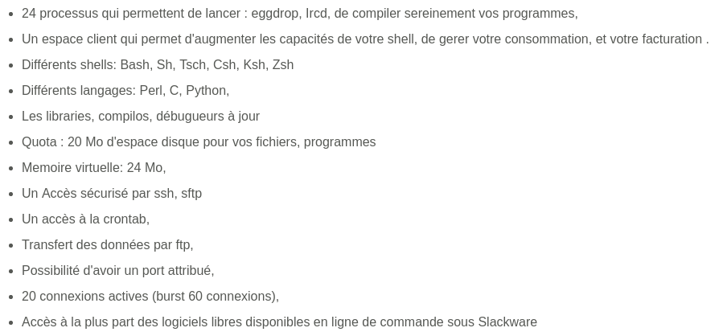
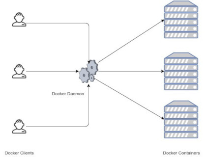
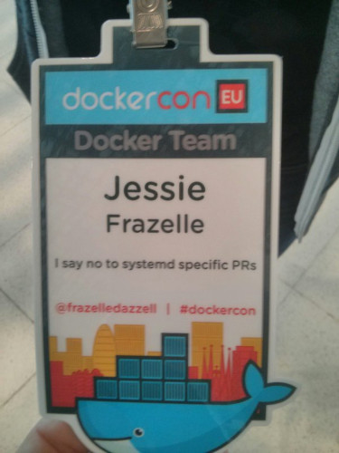
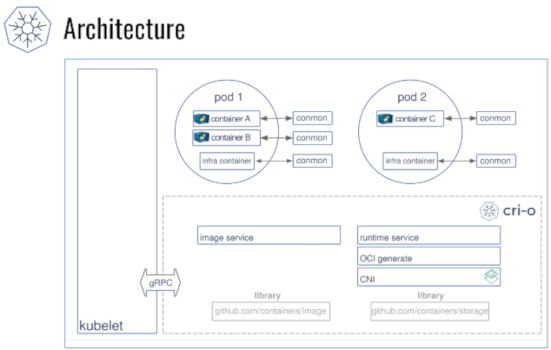

name: default
layout: true

class: center, middle
count: false
---
name: left
layout: true

class: left, middle
count: false
---
template: default

## Quo Vadis, containers?

### Devopsdays Warsaw 2018

2018-11-19, Warszawa 
Maciej Lasyk

---
template: left

# agenda

- disclaimer
- history of UNIX / Linux process and resources isolation
- technology wrap up
- summary

---
template: default

# disclaimer

---
template: default

### prepared based on following resources:

.left[.black[
- https://blog.aquasec.com/a-brief-history-of-containers-from-1970s-chroot-to-docker-2016
- https://opensource.com/article/18/1/history-low-level-container-runtimes
- https://opensource.com/article/17/7/how-linux-containers-evolved
- https://github.com/opencontainers/runc
- https://lwn.net/Articles/741897/
- http://blog.itaysk.com/2018/02/06/the-hitchhickers-guide-to-the-container-galaxy
- https://www.certdepot.net/death-of-docker/
- https://jpetazzo.github.io/2017/02/24/from-dotcloud-to-docker/
- https://blog.docker.com/2015/12/containerd-daemon-to-control-runc/
]]
---
template: default

### prepared based on following resources:

.left[.black[
- https://hackernoon.com/docker-containerd-standalone-runtimes-heres-what-you-should-know-b834ef155426
- https://blog.ycombinator.com/solomon-hykes-docker-dotcloud-interview/
- https://sstallion.blogspot.com/2010/08/opensolaris-is-dead.html
- https://docs.joyent.com/private-cloud
- http://0pointer.net/blog/walkthrough-for-portable-services.html
- https://opensource.com/article/18/10/podman-more-secure-way-run-containers
- https://media.ccc.de/b/conferences/all_systems_go/asg2018
- Marcin Skarbek (ha, I called u a resource XD)
]]

---
template: default

### What kind of problems containers should resolve?

.left[.black[
- application environment isolation (remember pip, npm and others?)
- resources isolation
- cross - platform compatibility
- resources density: don't leave resources unused
]]

---
template: default

### What is a Linux container?

.left[.black[
- resource limits (cgroups)
- security kind separation (lsms)
- virtual separation (namespaces)
- something to monitor container process, e.g. conmon, systemd
]]

---
template: default

### History of UNIX / Linux process and resources isolation

---
template: default

### 1979: Unix V7 / chroot

"During the development of Unix V7 in 1979, the chroot system call was introduced, 
changing the root directory of a process and its children to a new location in the 
filesystem. This advance was the beginning process isolation: segregating file 
access for each process. Chroot was added to BSD (Berkeley System Distribution) in 1982."

---
template: default

### 2000: FreeBSD Jails

"BSD history of containers with FreeBSD jails to achieve clear-cut separation 
between its services and those of its customers for security and ease of 
administration. FreeBSD Jails allows administrators to partition a FreeBSD 
computer system into several independent, smaller systems – called “jails” – with 
the ability to assign an IP address for each system and configuration."

---
template: default

### 2001: Linux VServer

Like FreeBSD Jails, Linux VServer is a jail mechanism that can partition 
resources (file systems, network addresses, memory) on a computer system. 
Introduced in 2001, this operating system virtualization that is implemented by 
patching the Linux kernel. Experimental patches are still available, but the 
last stable release was released in 2008

http://www.linux-vserver.org

---
template: default

### 2002: howto chroot on Linux

.left[.black[
- article by Nicolas Boiteux
- https://web.archive.org/web/20021014060228/http://membres.lycos.fr:80/code34/howtochroot1a/
- mounting /proc for managing processes
- mounting /etc/resolv.conf
]]

---
template: default

### 2003: Linux jails for moneys (PaaS, SaaS)

https://web.archive.org/web/20040612194051/http://girafon.org:80/index.php?page=Girafon-hebergement-eggdrop-bot-ircd-24-pids-shell-linux-pour-un-paiement-allopass

---
template: default

### 2004: Solaris Containers

.left[.black[
- In 2004, the first public beta of Solaris Containers was released that 
  combines system resource controls and boundary separation provided by zones, 
  which were able to leverage features like snapshots and cloning from ZFS.
- in 2005 opensourced by Sun as OpenSolaris
]]

---

template: default

### 2005: Open VZ (Open Virtuzzo)

"This is an operating system-level virtualization technology for Linux which uses 
a patched Linux kernel for virtualization, isolation, resource management and 
checkpointing. The code was not released as part of the official Linux kernel."

---
template: default

### 2006: Process Containers / cgroups

"Process Containers (launched by Google in 2006) was designed for limiting, 
accounting and isolating resource usage (CPU, memory, disk I/O, network) of a 
collection of processes. It was renamed “Control Groups (cgroups)” a year later 
and eventually merged to Linux kernel 2.6.24."

---
template: default

### 2008: LXC

.left[.black[
- LXC (LinuX Containers) was the first, most complete implementation of Linux 
  container manager. It was implemented in 2008 using cgroups and Linux 
  namespaces, and it works on a single Linux kernel without requiring any patches.
- C, Python, shell, LUA
]]

---
template: default

### 2009: dotCloud cloudlets and "dc"

.left[.black[
- dotCloud is a French PaaS provider
- it had proprietary solution ("dc"):
  - python cli for managing containers
  - acted as a frontend to LXC and AUFS
    - manage container images (pull/push them from/to a registry),
    - create a container using one of these images (leveraging AUFS copy-on-write),
    - configure the container, by allowing any file to be generated from a 
      template (for instance, putting the correct IP address in 
      /etc/network/interfaces),
    - start the container, by automatically creating its LXC configuration file 
      and invoking lxc-start,
    - dynamically expose ports, by managing a set of iptables rules,
- cloudlets
  - Solomon Hykes 1st commit: https://github.com/shykes/cloudlets
  - Cloudlets are universal server images for the cloud. They're lightweight, 
    version-controlled, and you can export them to any bootable format known 
    to man: Xen, KVM, Amazon EC2, or just a plain bootable CD.
  - Python based
]]

---
template: default

### 2010: Oracle acquires Sun Microsystems and closed Solaris

.left[.black[
- Illumos forks from Solaris
- Worked by some engineers who left Oracle / Sun
]]

---
template: default

### 2011: Warden

CloudFoundry started Warden in 2011, using LXC in the early stages and later 
replacing it with its own implementation. Warden can isolate environments on 
any operating system, running as a daemon and providing an API for container 
management. It developed a client-server model to manage a collection of 
containers across multiple hosts, and Warden includes a service to manage 
cgroups, namespaces and the process life cycle.

---
template: default

### 2011: systemd-nspawn

.left[.black[
- created for debugging boot process of Linux OS (by RedHat / Lennart & co)
- full blown OS inside w/systemd as init
- quite low - level
- this was mainly for debugging init process when working on systemd
- https://www.youtube.com/watch?v=s7LlUs5D9p4
]]

---
template: default

### 2012/2013: dotCloud pivots and starts Docker

.left[.black[
- "In a busy space dominated by Heroku (Salesforce) and Cloud Foundry (Pivotal), 
   DotCloud managed to get thousands of developers to build applications with 
   their stack."
- "Although DotCloud was successful, the management team soon realized that 
  customers wanted to be able to use any stack, move between any infrastructure 
  (public, private, virtualized, etc.) and be able to integrate with any 
  technology, something none of their competitors offered."
- "The company’s zoom-out pivot drastically changed their market. Companies 
  that used to compete with DotCloud had become partners of Docker, as 
  evidenced by competitor Heroku creating a PaaS implementation named Dokku 
  (Docker + Heroku)."
" When Docker emerged in 2013, containers exploded in popularity. It’s no 
  coincidence the growth of Docker and container use goes hand-in-hand. Just 
  as Warden did, Docker also used LXC in its initial stages and later replaced 
  that container manager with its own library, libcontainer. But there’s no 
  doubt that Docker separated itself from the pack by offering an entire 
  ecosystem for container management."
]]

---
template: default

### 2012/2013: dotCloud pivots -> Docker

.left[.black[
- docker engine does everything (images, containers etc)
- later dotCloud will separate from Docker inc and will be acquired by 
  Cloudcontrol (2014) which will bankrupt in 2015, will be acquired 
  (CloudControl) by Excoscale in 2016 and dotCloud service will be shutdown 
  for good.
]]

---
template: default

### 2013: LMCTFY

.left[.black[
- https://github.com/google/lmctfy
- Let Me Contain That For You (LMCTFY) kicked off in 2013 as an open-source 
  version of Google's container stack, providing Linux application containers. 
  Applications can be made “container aware,” creating and managing their own 
  subcontainers. Active deployment in LMCTFY stopped in 2015 after Google 
  started contributing core LMCTFY concepts to libcontainer, which is now part 
  of the Open Container Foundation.
- Kubernetes originally was developed to work w/lmctfy
- quite complicated w/high entry level
]]

---
template: default

### 2014: libct

.left[.black[
- https://github.com/xemul/libct
- c library w/go wrapper
- from openVZ
- push user interface to c library
- not lxc - important as that time lxc was most used
]]

---
template: default

### 2014: libvirt-lxc

.left[.black[
- RedHat didn't want to incorporate LXC into RHEL
  - docker-cli → docker-daemon → libvirt-lxc → pid1OfContainer
- finished w/libcontainer: Dan Walsh's team's work w/Docker Inc:
  - docker- cli → docker-daemon/libcontainer @ pid1OfContainer
]]

---
template: default

### 2014: SmartOs

.left[.black[
- Joyent create SmartOS based on Illumos:
  - containers / zones
  - deep integration with ZFS
  - DTrace
  - Linux syscalls implementation on Illumos Kernel (thanks to that can run 
    Docker containers in zones)
]]

---
template: default

### 2014: libcontainer

.left[.black[
- Docker & Red Hat & Google worked on it together
- to have something instead of lxc written in Go
- library for creating / removing / managing containers
- original OCI runtime - not called an OCI back then as no OCI (Open Container 
  Initiative)
]]

---
template: default

### 2014: coreos / rkt

.left[.black[
- rkt container engine: https://coreos.com/rkt/ (docker alternative)
- appc (app container specification): https://github.com/appc
- spec - first design (appc)
  - BSD implementation even: Jetpack
    - FreeBSD, jails, ZFS
    - https://github.com/3ofcoins/jetpack
]]

---
template: default

### 2014: Kubernetes

.left[.black[
- Kubernetes was released in 2014 by Google, as an open source container 
  orchestration platform, that was also donated to the CNCF.
- Initially, Kubernetes was just a way to run Docker containers in a cluster, 
  so it worked exclusively with Docker.
- Was based on Google's experiences w/Borg
- Original Google codename: Project Seven (Seven of Nine from Startrek, nicer 
  Borgs)
- Read this: https://cloud.google.com/blog/products/gcp/from-google-to-the-world-the-kubernetes-origin-story
]]

---
template: default

### 2014: GCE in GCP

.left[.black[
- Google Container Engine (alpha) in Google Cloud Platform
- Kubernetes 0.4.something
- 2015: beta, GA
]]

---
template: default

### 2014: lxd

.left[.black[
- container manager build on lxc
- commercial support by Canonical
- https://linuxcontainers.org/
- https://github.com/lxc/lxd
- fast as no virtualization
- is used e.g. used by chromebooks to run linux gui apps (see Project Crostini. 
  https://blog.simos.info/a-closer-look-at-chrome-os-using-lxd-to-run-linux-gui-apps-project-crostini/)
- an alternative to lxc tooling
]]

---
template: default

### 2014: shoebox (Grzesiek Nosek <3 )

.left[.black[
- https://github.com/gnosek/shoebox
- side project
- learning one?
- Python
- interesting to study how one can build something very, very simple
]]

---
template: default

### 2015: CNCF / OCI

.left[.black[
- CNCF: Cloud Native Computing Foundation (The Linux Foundation)
- OCI: Open Container Initiative
- CNCF founded: "Founding members included Google, CoreOS, Mesosphere, Red Hat, 
  Twitter, Huawei, Intel, Cisco, IBM, Docker, Univa, and VMware" 
- OCI: "Creating and maintaining formal 
  specifications ("OCI Specifications") for container image formats and 
  runtime (OCIs) , which will allow a compliant container to be portable 
  across all major, compliant operating systems and platforms without 
  artificial technical barriers." – OCI Charter
- Kubernetes donated by Google as the seed technology.
- runc under OCI: created & donated by RH & Docker
  - Then other tools can read this JSON file and execute a container on the rootfs
  - libcontainer parts of Docker were broken out and donated to the OCI
  - "Upstream Docker engineers and our engineers helped create a new frontend 
    tool to read the OCI Runtime Specification JSON file and interact with 
    libcontainer to run the container. This tool, called runc, was also donated 
    to the OCI."
]]

---
template: default

### 2015: containerd (CRI)

.left[.black[
- CRI: container runtime interface
- https://github.com/containerd/containerd/
- Containerd is an industry-standard core container runtime. It is currently 
  available as a daemon for Linux and Windows, which can manage the complete 
  container lifecycle of its host system. In 2015, Docker donated the OCI 
  Specification to The Linux Foundation with a reference implementation called 
  runc.
- runc - oci runtime
- to run a container:
  - Docker engine creates the image
  - pass it to containerd
  - containerd calls containerd-shim that uses runC to run the container
  - containerd-shim allows the runtime (runC in this case) to exit after it 
    starts the container
  - This way we can run daemon-less containers because we are not having to 
    have the long running runtime processes for containers
]]
---
template: default

### 2016: Kubernetes CRI

.left[.black[
- "In December 2016, Kubernetes abstracted the container runtime implementation 
   from the kubelet using an interface. This interface is called ‘Container 
   Runtime Interface’, or ‘CRI’ for short."
- "When the CRI was released, the first obvious implementation of this 
   interface was naturally for Docker, this implementation is now called 
   ‘dockershim’ (initially ‘CRI-Docker’) and is used by default with every 
   default installation of Kubernetes."
- "After reading the chain of events in the Docker ecosystem, you might wonder 
   how it affects the Kubernetes ecosystem. Well, every one of those container 
   runtime variations found it’s way into a CRI implementation. rkt, 
   containerd, etc…"
- "Another interesting CRI implementation if ‘CRI-O’ (CRI+OCI, originally 
   called ‘OCID’). This Red Hat led project tried to build a minimal CRI 
   implementation, based on best-of-breed open source components, that is built 
   for Kubernetes first."
]]

---
template: default

### 2015/2016: Docker & RH problems

---
template: default

### 2015/2016: Docker & RH problems

.left[.black[
- Container conception: Solomon Hykes from Docker couldn’t agree with Lennart 
  Poettering from RedHat on the container vision,
- Dan Walsh & SELinux & Systemd: https://www.youtube.com/watch?v=93VPog3EKbs
- Container security: frustration in the RedHat security team was high because 
  of difficulties to integrate patches into the Docker product,
- Container stability: the Docker company was always adding new features based 
  on new Linux kernels into its product, triggering an insane amount of work 
  to backport all these features into the 3.10 kernel used by most of RedHat 
  products (RHEL 7, Atomic, OpenShift, etc),
- So called "Docker fork" by Google and RedHat (later CRI-O): 
  https://thenewstack.io/oci-building-way-kubernetes-run-containers-without-docker/
]]

---
template: default

### 2015: Garden

.left[.black[
- CloudFoundry replacement for Warden
- Golang client / server for container creation and management for 
- different platforms
  - Linux: Guardian with runc
  - Windows backend
- https://github.com/cloudfoundry/garden
]]

---
template: default

### 2015: ECS in AWS

Elastic Container Service in AWS (Docker)

---
template: default

### 2015: Azure ACS

.left[.black[
- Azure Container Service
- multiple container orchestrators (Docker, Mesosphere DC/OS)
]]

---
template: default

### 2016: skopeo

.left[.black[
- Project Atomic subproject
- needed for inspecting images stored on remote registries
- no need to pull image
- now pull & push also (so no need for using Docker daemon for that)
- support for "Open Container Image Layout Specification" format
- and many more: plain tar, oci tar, oci http, container-storage, 
  docker-daemon, docker-http)
]]

---
template: default

### 2016: SDC->Triton

.left[.black[
- Joyent created SmartDataCenter -> Triton that uses SmartOS beneath
  - SmartOS zones provides high performance container virtualization. KVM 
    support on top of zones means secure full Linux and Windows guest OS 
    support.
  - RESTful API and CLI tooling for customer self-service
  - Complete operator portal (web app)
  - Robust and observable service oriented architecture (implemented primarily 
    in Node.js)
  - Automated USB key installation
- btw: do see [Bryan Cantrill](https://www.youtube.com/channel/UCBBIgxO-8jgVZpsj6uk4aVA) 
  talks if u don't know him yet!
]]

---
template: default

### 2017: OCI spec split into 2 v1.1.0

.left[.black[
- image spec https://github.com/opencontainers/image-spec/releases/tag/v1.0.0
  - layout
  - manifest
  - FS layers
  - image configuration
- runtime spec https://github.com/opencontainers/runtime-spec/releases/tag/v1.0.0
  - platforms: Linux, Solaris, Windows
  - containers lifecycle - set of standard operations
  - execution environment (namespaces, networking, cgroups)
  - filesystem: config.json + root FS
- https://www.opencontainers.org/release-notices/v1-0-0
]]

---
template: default

### 2017: CRI-O (container runtime interface)

.left[.black[
- "This is a very exciting day for the CRI-O Engineering team. Just over a year 
  ago, back in September 2016, Mrunal Patel and Antonio Murdaca of my 
  engineering team created a skunkworks project named OCID, that was later 
  renamed CRI-O. The goal was to figure out if we could build a simple daemon 
  that could support and be dedicated to the Kubernetes Container Runtime 
  Interface (CRI) and be able to run Open Container Initiative (OCI) 
  containers. Thus the name, CRI-O." (Dan Walsh)
- CRI-O owes a great deal of gratitude to the upstream Docker project. As 
  Isaac Newton said “If I have seen further, it is by standing on the shoulders 
  of giants.”
- oci images and runtime
- primarily managed containers w/ runc, but now there're others (podman etc)
- uses CNI plugins for networking https://github.com/containernetworking/cni
- trusted and untrusted containers working together
- conmon: 
  - conmon (and not the CRI daemon) is the parent process of the container
  - monitoring, logging, handling containers ooms, tty allocation
]]

---
template: default

.left[.black[
- Kubernetes sends a message to the kubelet that it wants it to run the NGINX 
  server:
- The kubelet calls out to the CRI-O to tell it to run NGINX.
- CRI-O finds an OCI Image at a container registry.
- CRI-O uses containers/image to pull the image from the registry to the host.
- CRI-O unpacks the image onto local storage using containers/storage.
- CRI-O launches a OCI Runtime Specification, usually runc, and starts the 
  container. As I stated previously, the Docker daemon launches its containers 
  using runc, in exactly the same way.
]]

---
template: default

### 2017: Moby

.left[.black[
- At the core of Moby is a framework to assemble specialized container systems. 
  It provides: 
  - A library of containerized components for all vital aspects of a container 
    system: OS, container runtime, orchestration, infrastructure management, 
    networking, storage, security, build, image distribution, etc.
  - Tools to assemble the components into runnable artifacts for a variety of 
    platforms and architectures: bare metal (both x86 and Arm); executables 
    for Linux, Mac and Windows; VM images for popular cloud and virtualization 
    providers.
  - A set of reference assemblies which can be used as-is, modified, or used 
    as inspiration to create your own.
  - All Moby components are containers, so creating new components is as easy 
    as building a new OCI-compatible container.
]]

---
template: default
### 2017: Moby

.left[.black[
- Moby is recommended for anyone who wants to assemble a container-based 
  system. This includes:
  - Hackers who want to customize or patch their Docker build
  - System engineers or integrators building a container system
  - Infrastructure providers looking to adapt existing container systems to 
    their environment
  - Container enthusiasts who want to experiment with the latest container tech
  - Open-source developers looking to test their project in a variety of 
    different systems
  - Anyone curious about Docker internals and how it’s built
]]

---
template: default
### 2017: Moby

.left[.black[
- Moby is NOT recommended for:
  - Application developers looking for an easy way to run their applications 
    in containers. We recommend Docker CE instead.
  - Enterprise IT and development teams looking for a ready-to-use, 
    commercially supported container platform. We recommend Docker EE instead.
  - Anyone curious about containers and looking for an easy way to learn. We 
    recommend the docker.com website instead.
- Docker is transitioning all of its open source collaborations to the Moby 
  project going forward. During the transition, all open source activity should 
  continue as usual.
]]

---
template: default

### 2017: buildah

.left[.black[
- RedHat tool for building images (again Dan Walsh); Nalin Dahyabhai as the 
  first author
- drop-in replacement for docker build
- support non-root builds
- "One of the main concepts of security is to keep the amount of content 
  inside of an OS image as small as possible to eliminate unwanted tools. The 
  idea is that a hacker might need tools to break through an application, and 
  if the tools such as gcc, make, dnf are not present, the attacker can be 
  stopped or confined."
- Docker needs tools inside of an image to run e.g. RUN commands
- Buildah builds images from outside - very lightweight and fast (like mkosi)
- buildah can build a container image using a Dockerfile.
- "We want to move tools like ansible-containers and OpenShift S2I to use 
  buildah rather than requiring a container runtime daemon."
]]

---
template: default

### 2017: Azure AKS

Azure Kubernetes Service (or Container, renamed ACS)

---
template: default

### 2018: oci distribution spec

.left[.black[
- formerly docker registry api
- not a "distribution" like a Linux distro; it's about providing images
- https://github.com/opencontainers/distribution-spec
- "The goal of this specification is to standardize container image 
  distribution"
  - image verification
  - resumable push
  - resumable pull
  - Layer Upload De-duplication
]]

---
template: default

### 2018: systemd-nspawn oci runtime

.left[.black[
- "If someone wants to implement a native systemd-nspawn --oci OCI-SPEC.json 
  and get it accepted by the systemd team for support, then CRI-O, Docker, and 
  eventually Podman would be able to use it in addition to runc and Clear 
  Container/runV (Kata). (No one on my team is working on this.)" (note from 
  2018 by Walsh)
- Lennart did this finally - awaiting being merged now
]]

---
template: default

### 2018: RH acquires CoreOS

---
template: default

### 2018: podman

.left[.black[
- Red Hat behind; stareted under Project Atomic
- formerly kpod
- originally part of CRI-O
- alias for docker
- Podman is a tool designed for managing pods and containers without requiring 
  a container daemon
- basically: docker run, start, stop, commit, build, etc
- no daemon #nobigfatdaemons (fork/exec model)
- cgroups or security constraints still control the container processes
- working on libpod (container management library)
- support non-root
- 2019: podman 1.0?
  - Matt Heon: 8:36:05 PM - mheon: dowdle: and we'll probably be considering a 
    1.0 release around january and declaring things properly stable
]]

---
template: default

### 2018: AKS in AWS

Amazon Elastic Container Service for Kubernetes in AWS

---
template: default

### 2018: systemd portable services

.left[.black[
- At devcon announced concept by Lennart Poettering
- Announced by Lennart Poettering on ASG conf: https://media.ccc.de/v/ASG2018-200-portable_services_are_ready_to_use#t=2 w/sd239
- like a chroot, but on systemd
- goals: 
  - leave no artifacts! (system users, tmp files etc)
  - everything in one place
  - feel like a native service (systemctl integration)
  - don't create whole world like containers (networking, storage etc)
- great idea for builds, creating temporary envs for running transient jobs etc
- system services + some container features
- resource bundles, integration, sandboxing
]]

---
template: default

### 2018: IBM acquires RH

"IBM is open by design"

https://developer.ibm.com/articles/cl-open-architecture-update/

.left[.black[
- Apache foundation
- Eclipse foundation
- CNCF
- Docker / libcontainer + containerd
- Istio
- node.js open governance help by IBM
]]

---
template: default

### 2018: RedHat - what next?

.left[.black[
- coreos will die; no more need for rkt and appc
- atomic host will die: tools well tested and moved to cri-o / k8s (skopeo, 
  buildah, cockpit, some others); no more needed
- RHEL can't be changed - it is enterprise and has low frequency release 
  cycle; can't run kubernetes on old RHEL kernels
- RH Coreos v/Openshift w/Kubernetes & CRI-O - coreos is a well - known name
]]

---
template: default

### technology wrap up

.left[.black[
- what is a Linux container?
  - "Containers are Linux—Linux is Containers"
  - resource limits (cgroups)
  - security kind separation (lsms)
  - virtual separation (namespaces)
  - container image via OCI image specification
  - container runtime via OCI specification (e.g.runc)
  - CNI (container networking interface)
  - something to monitor container process, e.g. conmon, systemd
]]

---
template: default

### technology wrap up

.left[.black[
- container runtime interfaces
  - cri-o
    - crictl - tool for interacting cri layer (mainly for debugging)
  - containerd
  - alibaba/pouch
    - very wide adoption of other technologies
    - uses kvm pieces
    - 2.6.32+ kernel (rhel 6)
    - imports from runc, docker, p2p torrent backend, exposes cri socket
    - Thanks Vincent Batts! https://media.ccc.de/v/ASG2018-186-container_runtimes_draw_some_lines
]]

---
template: default

### technology wrap up

.left[.black[
- oci runtimes
  - nspawn-oci for systemd-nspawn
  - libcontainer
  - hyperv's runv
  - oracle/railcar
  - kata-containers (KVM)
  - nabia-containers
  - nvidia fork of runc
  - google/gvisor
  - windows/hcsshim
  - rkt - non oci
]]

---
template: default

### technology wrap up

.left[.black[
- 3 specifications currently from OCI
  - image
  - runtime
  - distribution
]]

---
template: default

### Part 2: OCIs walkthrough

another conference or meetup

send me invitation if interested ;)

---
template: default

### thank you!

https://maciej.lasyk.info/slides/2018-devopsdays-warsaw-quo-vadis-containers/

github/docent-net/ 
twitter@docent-net 
https://maciej.lasyk.info 
https://dlugodystansowy.pl
