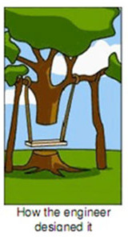
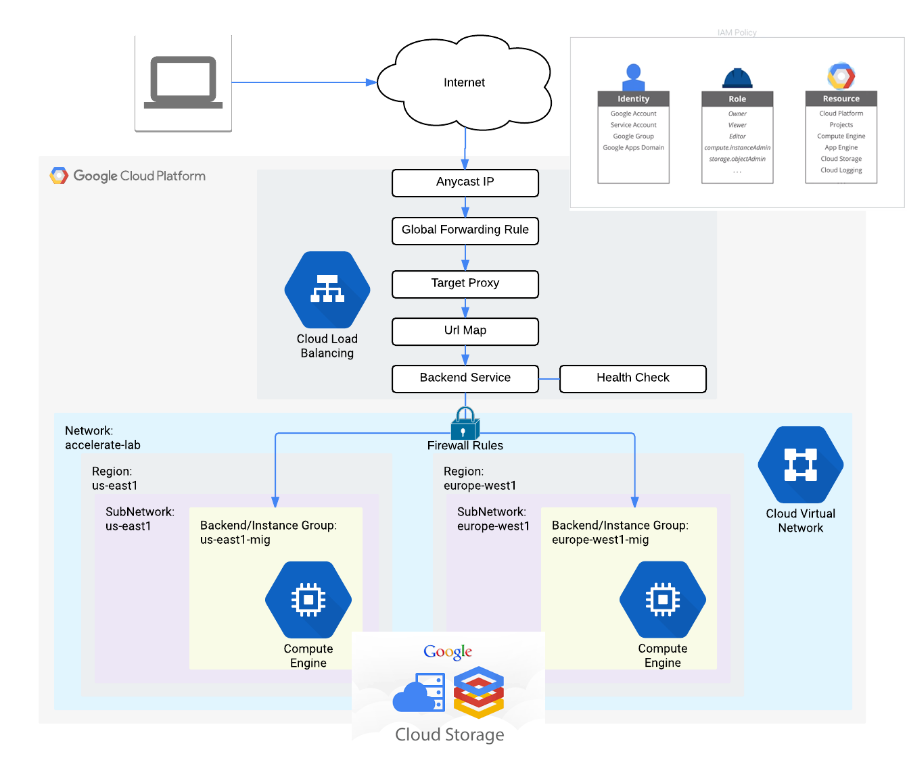
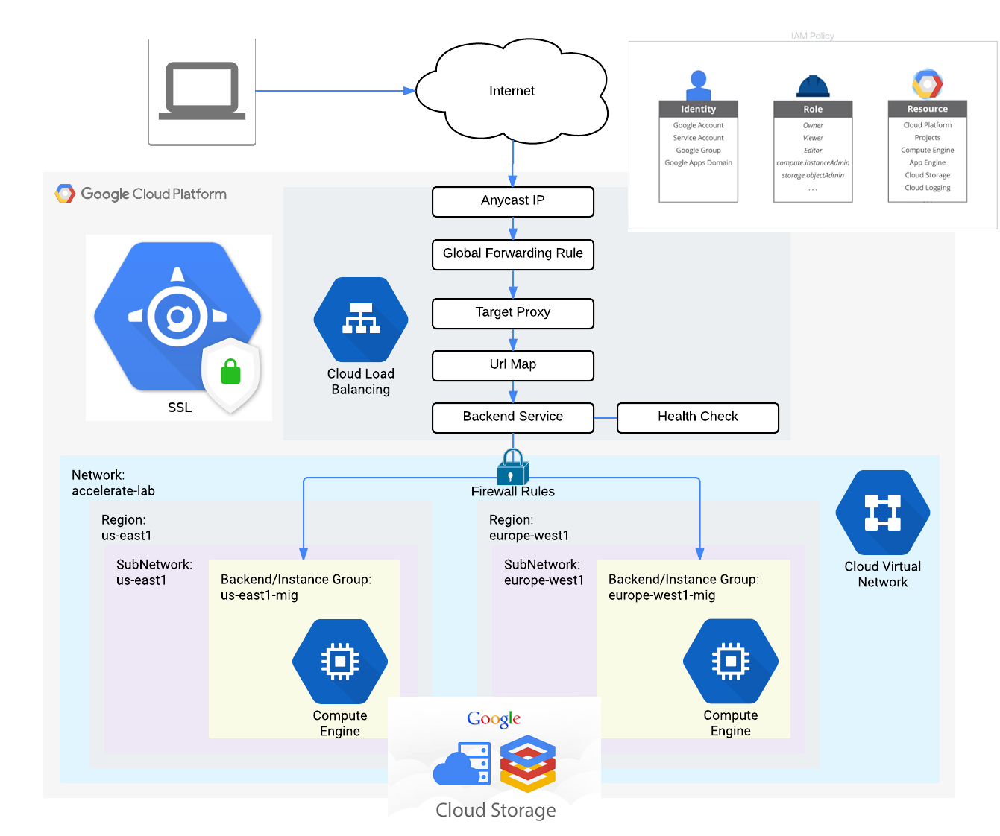
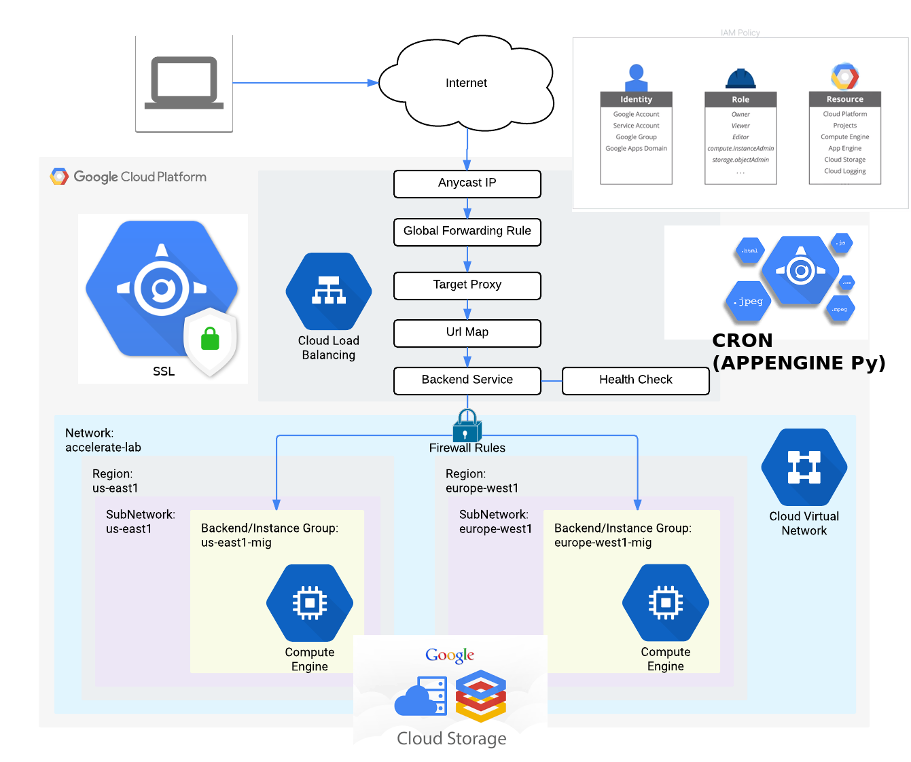
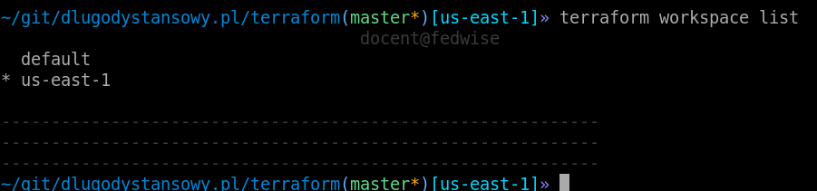
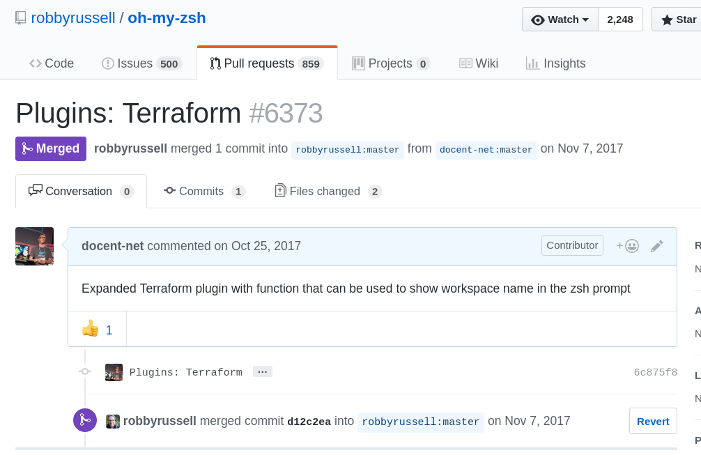

name: default
layout: true

class: center, middle
count: false
---
name: left
layout: true

class: left, middle
count: false
---
template: default

# Google Cloud Platform and Terraform: diary of a combatant
&nbsp;
&nbsp;
&nbsp;
## DevOpsKRK #10

2018-01-17<br>
Maciej Lasyk

---
template: left

# Why?

--

- client: 
   - we need this something outside of AWS

--

- developers:
   - make it self healing
   - all infra in code
   - best is self manage'able xD

--

- me:
   - wrappable in Rundeck

---
template: default

# Google Cloud Platform

.left[
- outside of AWS
- You get $300 for starters for 12 months
- there's "always free" tier
- it's rather stable these days (been working in GCP for almost 2 years now)
]

---
template: default

# Terraform

.left[
- now you probably know everything about it
- plus it has GCP modules
- can be easily integrated w/Rundeck
] 

---
template: default

# So what we wanna do?



---
template: default


---
template: default


template: default

---
template: default



template: default

---
template: default



template: default

---
template: default



template: default

---

# Bootstrapping GCP project

There need to be something before Terraform:

.left[
```bash
gcloud auth login
gcloud projects create dlugodystansowy-pl --name=dlugodystansowy-pl \
    --organization=666666666
gcloud beta billing projects link dlugodystansowy-pl \
    --billing-account=99999999
gcloud config set project dlugodystansowy-pl
gcloud iam service-accounts create terraform --display-name=terraform
gcloud iam service-accounts keys create gce-terraform-key.json \
    --iam-account=terraform@dlugodystansowy-pl.iam.gserviceaccount.com
export GOOGLE_APPLICATION_CREDENTIALS=/somewhere/dlugodystansowy-pl-gce-terraform-key.json
gsutil mb -p dlugodystansowy-pl -c multi_regional gs://dl-terraform-states
gsutil acl ch -u terraform@dlugodystansowy-pl.iam.gserviceaccount.com:W \
    gs://dl-terraform-states
gcloud service-management enable compute.googleapis.com
gcloud service-management enable iam.googleapis.com
gcloud service-management enable cloudresourcemanager.googleapis.com
gcloud projects add-iam-policy-binding dlugodystansowy-pl --member \
    serviceAccount:terraform@dlugodystansowy-pl.iam.gserviceaccount.com --role roles/owner
```
]

---
template: default

# Terraform

And now only: **terraform plan && apply**

Even **terraform destroy** works these days :)

---
template: default

# xD

.left[
- null_resource / local-exec & depends-on
- IAM is not atomic like iptables - watch out for possible race - conditions(!)
- check twice if module is idempotent(!)
]

---
template: default
# bonus: workspaces



---
template: default
# bonus: workspaces



---
template: default

# Thanks, Q&A?

.left[
- slides: [https://maciej.lasyk.info/2018/Jan/17/devops-meetups-krakow/](https://maciej.lasyk.info/2018/Jan/17/devops-meetups-krakow/)
- code: [https://github.com/docent-net/dlugodystansowy.pl](https://github.com/docent-net/dlugodystansowy.pl)
]
