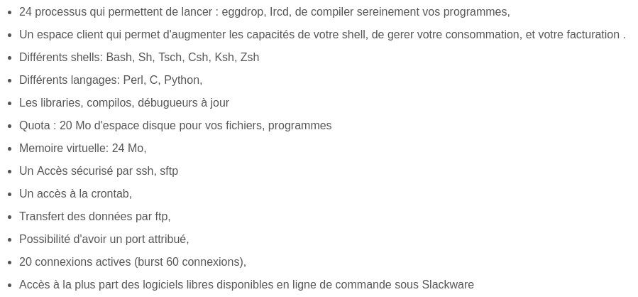
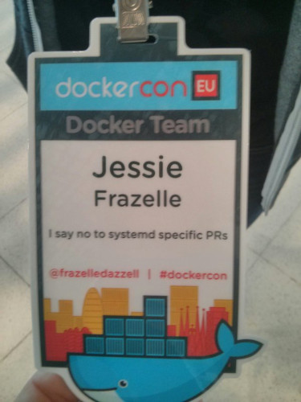
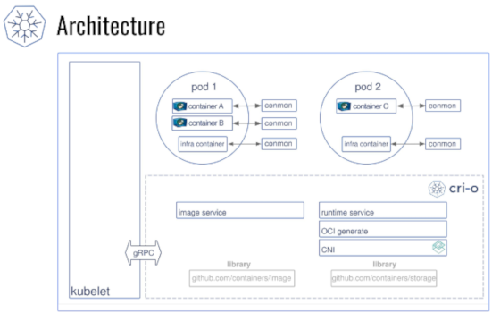

name: default
layout: true

class: center, middle
count: false
---
name: left
layout: true

class: left, middle
count: false
---
template: default

## Quo Vadis, containers?

### Jesień Linuksowa 2018

2018-11-10, Ustroń<br>
Maciej Lasyk

---
template: left

# agenda

- disclaimer
- history of UNIX / Linux process and resources isolation
- technology wrap up
- What kind pf problems containers should resolve?
- OCIs walkthrough walkthrough
- Summary

---
template: default

# disclaimer

---
template: default

### prepared based on following resources:

.left[.black[
- https://blog.aquasec.com/a-brief-history-of-containers-from-1970s-chroot-to-docker-2016
- https://opensource.com/article/18/1/history-low-level-container-runtimes
- https://opensource.com/article/17/7/how-linux-containers-evolved
- https://github.com/opencontainers/runc
- https://lwn.net/Articles/741897/
- http://blog.itaysk.com/2018/02/06/the-hitchhickers-guide-to-the-container-galaxy
- https://www.certdepot.net/death-of-docker/
- https://jpetazzo.github.io/2017/02/24/from-dotcloud-to-docker/
- https://blog.docker.com/2015/12/containerd-daemon-to-control-runc/
]]
---
template: default

### prepared based on following resources:

.left[.black[
- https://hackernoon.com/docker-containerd-standalone-runtimes-heres-what-you-should-know-b834ef155426
- https://blog.ycombinator.com/solomon-hykes-docker-dotcloud-interview/
- https://sstallion.blogspot.com/2010/08/opensolaris-is-dead.html
- https://docs.joyent.com/private-cloud
- http://0pointer.net/blog/walkthrough-for-portable-services.html
- https://opensource.com/article/18/10/podman-more-secure-way-run-containers
- https://media.ccc.de/b/conferences/all_systems_go/asg2018
- Marcin Skarbek (ha, I called u a resource XD)
]]

---
template: default

### What kind of problems containers should resolve?

.left[.black[
- application environment isolation (remember pip, npm and others?)
- resources isolation
- cross - platform compatibility
- resources density: don't leave resources unused
]]

---
template: default

### what is a Linux container?

.left[.black[
- resource limits (cgroups)
- security kind separation (lsms)
- virtual separation (namespaces)
- something to monitor container process, e.g. conmon, systemd
]]

---
template: default

### history of UNIX / Linux process and resources isolation

---
template: default

### 1979: Unix V7 / chroot

During the development of Unix V7 in 1979, the chroot system call was introduced, 
changing the root directory of a process and its children to a new location in the 
filesystem. This advance was the beginning process isolation: segregating file 
access for each process. Chroot was added to BSD (Berkeley System Distribution) in 1982.

---
template: default

### 2000: FreeBSD Jails

BSD history of containers with FreeBSD jails to achieve clear-cut separation 
between its services and those of its customers for security and ease of 
administration. FreeBSD Jails allows administrators to partition a FreeBSD 
computer system into several independent, smaller systems – called “jails” – with 
the ability to assign an IP address for each system and configuration.

---
template: default

### 2001: Linux VServer

Like FreeBSD Jails, Linux VServer is a jail mechanism that can partition 
resources (file systems, network addresses, memory) on a computer system. 
Introduced in 2001, this operating system virtualization that is implemented by 
patching the Linux kernel. Experimental patches are still available, but the 
last stable patch was released in 2006

---
template: default

### 2002: howto chroot on Linux

.left[.black[
- article by Nicolas Boiteux
- https://web.archive.org/web/20021014060228/http://membres.lycos.fr:80/code34/howtochroot1a/
- mounting /proc for managing processes
- mounting /etc/resolv.conf
]]

---
template: default

### 2003: Linux jails for moneys (PaaS, SaaS)



https://web.archive.org/web/20040612194051/http://girafon.org:80/index.php?page=Girafon-hebergement-eggdrop-bot-ircd-24-pids-shell-linux-pour-un-paiement-allopass

---
template: default

### 2004: Solaris Containers

.left[.black[
- In 2004, the first public beta of Solaris Containers was released that combines system resource controls and boundary separation provided by zones, which were able to leverage features like snapshots and cloning from ZFS.
- in 2005 opensourced by Sun as OpenSolaris
]]

---

template: default

### 2005: Open VZ (Open Virtuzzo)

This is an operating system-level virtualization technology for Linux which uses 
a patched Linux kernel for virtualization, isolation, resource management and 
checkpointing. The code was not released as part of the official Linux kernel.

---
template: default

### 2006: Process Containers / cgroups

Process Containers (launched by Google in 2006) was designed for limiting, 
accounting and isolating resource usage (CPU, memory, disk I/O, network) of a 
collection of processes. It was renamed “Control Groups (cgroups)” a year later 
and eventually merged to Linux kernel 2.6.24.

---
template: default

### 2008: LXC

.left[.black[
- LXC (LinuX Containers) was the first, most complete implementation of Linux container manager. It was implemented in 2008 using cgroups and Linux namespaces, and it works on a single Linux kernel without requiring any patches.
- C, Python, shell, LUA
]]

---
template: default

### 2009: dotCloud cloudlets and "dc"

.left[.black[
- dotCloud is a French PaaS provider
- it had proprietary solution ("dc"):
  - python cli for managing containers
  - acted as a frontend to LXC and AUFS
    - manage container images (pull/push them from/to a registry),
    - create a container using one of these images (leveraging AUFS copy-on-write),
    - configure the container, by allowing any file to be generated from a template (for instance, putting the correct IP address in /etc/network/interfaces),
    - start the container, by automatically creating its LXC configuration file and invoking lxc-start,
    - dynamically expose ports, by managing a set of iptables rules,
- cloudlets
  - Solomon Hykes 1st commit: https://github.com/shykes/cloudlets
  - Cloudlets are universal server images for the cloud. They're lightweight, version-controlled, and you can export them to any bootable format known to man: Xen, KVM, Amazon EC2, or just a plain bootable CD.
  - Python based
]]

---
template: default

### 2010: Oracle acquires Sun Microsystems and closed Solaris

.left[.black[
- Illumos forks from Solaris
- Worked by some engineers who left Oracle / Sun
]]

---
template: default

### 2011: Warden

CloudFoundry started Warden in 2011, using LXC in the early stages and later 
replacing it with its own implementation. Warden can isolate environments on 
any operating system, running as a daemon and providing an API for container 
management. It developed a client-server model to manage a collection of containers 
across multiple hosts, and Warden includes a service to manage cgroups, 
namespaces and the process life cycle.

---
template: default

### 2011: systemd-nspawn

.left[.black[
- created for debugging boot process of Linux OS (by RedHat / Lennart & co)
- full blown OS inside w/systemd as init
- quite low - level
- this was mainly for debugging init process when working on systemd
- https://www.youtube.com/watch?v=s7LlUs5D9p4
]]

---
template: default

### 2012/2013: dotCloud pivots and starts Docker

.left[.black[
- "In a busy space dominated by Heroku (Salesforce) and Cloud Foundry (Pivotal), DotCloud managed to get thousands of developers to build applications with their stack."
- "Although DotCloud was successful, the management team soon realized that customers wanted to be able to use any stack, move between any infrastructure (public, private, virtualized, etc.) and be able to integrate with any technology, something none of their competitors offered."
- "The company’s zoom-out pivot drastically changed their market. Companies that used to compete with DotCloud had become partners of Docker, as evidenced by competitor Heroku creating a PaaS implementation named Dokku (Docker + Heroku)."
" When Docker emerged in 2013, containers exploded in popularity. It’s no coincidence the growth of Docker and container use goes hand-in-hand. Just as Warden did, Docker also used LXC in its initial stages and later replaced that container manager with its own library, libcontainer. But there’s no doubt that Docker separated itself from the pack by offering an entire ecosystem for container management."
]]

---
template: default

### 2012/2013: dotCloud pivots and starts Docker


.left[.black[
- docker engine does everything (images, containers etc)
- later dotCloud will separate from Docker inc and will be acquired by Cloudcontrol (2014) which will bankrupt in 2015, will be acquired (CloudControl) by Excoscale in 2016 and dotCloud service will be shutdown for good.
]]

---
template: default

### 2013: LMCTFY

.left[.black[
- https://github.com/google/lmctfy
- Let Me Contain That For You (LMCTFY) kicked off in 2013 as an open-source version of Google's container stack, providing Linux application containers. Applications can be made “container aware,” creating and managing their own subcontainers. Active deployment in LMCTFY stopped in 2015 after Google started contributing core LMCTFY concepts to libcontainer, which is now part of the Open Container Foundation.
- Kubernetes originally was developed to work w/lmctfy
- quite complicated w/high entry level
]]

---
template: default

### 2014: libct

.left[.black[
- https://github.com/xemul/libct
- c library w/go wrapper
- from openVZ
- push user interface to c library
- not lxc - important as that time lxc was most used
]]

---
template: default

### 2014: libvirt-lxc

.left[.black[
- RedHat didn't want to incorporate LXC into RHEL
- docker-cli → docker-daemon → libvirt-lxc → pid1OfContainer
- finished w/libcontainer: Dan Walsh's team's work w/Docker Inc:
- docker- cli → docker-daemon @ pid1OfContainer
]]

---
template: default

### 2014: SmartOs

.left[.black[
- Joyent create SmartOS based on Illumos:
  - containers / zones
  - deep integration with ZFS
  - DTrace
  - Linux syscalls implementation on Illumos Kernel (thanks to that can run Docker containers in zones)
]]

---
template: default

### 2014: libcontainer

.left[.black[
- Docker & Google worked on it together
- to have something instead of lxc written in Go
- library for creating / removing / managing containers
- original OCI runtime - not called an OCI back then as no OCI
]]

---
template: default

### 2014: coreos / rkt

.left[.black[
- rkt container engine: https://coreos.com/rkt/ (docker alternative)
- appc (app container specification): https://github.com/appc
- spec - first design (appc)
  - BSD implementation even: Jetpack
    - FreeBSD, jails, ZFS
    - https://github.com/3ofcoins/jetpack
]]

---
template: default

### 2014: Kubernetes

.left[.black[
- Kubernetes was released in 2014 by Google, as an open source container orchestration platform, that was also donated to the CNCF.
- Initially, Kubernetes was just a way to run Docker containers in a cluster, so it worked exclusively with Docker.
- Was based on Google's experiences w/Borg
- Original Google codename: Project Seven (Seven of Nine from Startrek, nicer Borgs)
]]

---
template: default

### 2014: lxd

.left[.black[
- container manager build on lxc
- commercial support by Canonical
- https://linuxcontainers.org/
- https://github.com/lxc/lxd
- fast as no virtualization
- is used e.g. used by chromebooks to run linux gui apps (see Project Crostini. https://blog.simos.info/a-closer-look-at-chrome-os-using-lxd-to-run-linux-gui-apps-project-crostini/)
- an alternative to lxc tooling
]]

---
template: default

### 2014: shoebox (Grzesiek Nosek <3 )

.left[.black[
- https://github.com/gnosek/shoebox
- side project
- learning one?
- Python
- interesting to study how one can build something very, very simple
]]

---
template: default

### 2015: CNCF (Cloud Native Computing Foundation) / OCI

.left[.black[
- founded: "Founding members included Google, CoreOS, Mesosphere, Red Hat, Twitter, Huawei, Intel, Cisco, IBM, Docker, Univa, and VMware" 
- part of The Linux Foundation
- OCI: Open Container Initiative: "Creating and maintaining formal specifications ("OCI Specifications") for container image formats and runtime (OCIs) , which will allow a compliant container to be portable across all major, compliant operating systems and platforms without artificial technical barriers." – OCI Charter
- Kubernetes 1.0: Kubernetes is an open source framework for automating deployment and managing applications in a containerized and clustered environment
- Originally designed by Google and donated to The Linux Foundation to form the Cloud Native Computing Foundation with Kubernetes as the seed technology.
- runc under OCI: created & donated by RH & Docker
  - Then other tools can read this JSON file and execute a container on the rootfs
  - libcontainer parts of Docker were broken out and donated to the OCI
  - "Upstream Docker engineers and our engineers helped create a new frontend tool to read the OCI Runtime Specification JSON file and interact with libcontainer to run the container. This tool, called runc, was also donated to the OCI."
]]

---
template: default

### 2015: containerd (container runtime interface):

.left[.black[
- container runtime interface
- https://github.com/containerd/containerd/
- Containerd is an industry-standard core container runtime. It is currently available as a daemon for Linux and Windows, which can manage the complete container lifecycle of its host system. In 2015, Docker donated the OCI Specification to The Linux Foundation with a reference implementation called runc.
- runc - oci runtime
- to run a container:
  - Docker engine creates the image
  - pass it to containerd
  - containerd calls containerd-shim that uses runC to run the container
  - containerd-shim allows the runtime (runC in this case) to exit after it starts the container
  - This way we can run daemon-less containers because we are not having to have the long running runtime processes for containers
]]

---
template: default

### 2015/2016: Docker & RH problems



---
template: default

### 2015/2016: Docker & RH problems

.left[.black[
- Container conception: Solomon Hykes from Docker couldn’t agree with Lennart Poettering from RedHat on the container vision,
- Dan Walsh & SELinux & Systemd: https://www.youtube.com/watch?v=93VPog3EKbs
- Container security: frustration in the RedHat security team was high because of difficulties to integrate patches into the Docker product,
- Container stability: the Docker company was always adding new features based on new Linux kernels into its product, triggering an insane amount of work to backport all these features into the 3.10 kernel used by most of RedHat products (RHEL 7, Atomic, OpenShift, etc),
- So called "Docker fork" by Google and RedHat (later CRI-O): https://thenewstack.io/oci-building-way-kubernetes-run-containers-without-docker/
]]

---
template: default

### 2015: Garden

.left[.black[
- CloudFoundry replacement for Warden
- Golang client / server for container creation and management for 
- different platforms
  - Linux: Guardian with runc
  - Windows backend
- https://github.com/cloudfoundry/garden
]]

---
template: default

### 2016: Kubernetes CRI

.left[.black[
- "In December 2016, Kubernetes abstracted the container runtime implementation from the kubelet using an interface. This interface is called ‘Container Runtime Interface’, or ‘CRI’ for short."
- "When the CRI was released, the first obvious implementation of this interface was naturally for Docker, this implementation is now called ‘dockershim’ (initially ‘CRI-Docker’) and is used by default with every default installation of Kubernetes."
- "After reading the chain of events in the Docker ecosystem, you might wonder how it affects the Kubernetes ecosystem. Well, every one of those container runtime variations found it’s way into a CRI implementation. rkt, containerd, etc…"
- "Another interesting CRI implementation if ‘CRI-O’ (CRI+OCI, originally called ‘OCID’). This Red Hat led project tried to build a minimal CRI implementation, based on best-of-breed open source components, that is built for Kubernetes first."
]]


---
template: default

### 2016: skopeo

.left[.black[
- Project Atomic subproject
- needed for inspecting images stored on remote registries
- no need to pull image
- now pull & push also (so no need for using Docker daemon for that)
- "oci:path:tag An image tag in a directory compliant with "Open Container Image Layout Specification" at path.
- and many more (plain tar, oci tar, oci http, container-storage, docker-daemon, docker-http)
]]

---
template: default

### 2016: SDC->Triton

.left[.black[
- Joyent created SmartDataCenter -> Triton that uses SmartOS beneath
  - SmartOS zones provides high performance container virtualization. KVM support on top of zones means secure full Linux and Windows guest OS support.
  - RESTful API and CLI tooling for customer self-service
  - Complete operator portal (web app)
  - Robust and observable service oriented architecture (implemented primarily in Node.js)
  - Automated USB key installation
- btw: do see [Bryan Cantrill](https://www.youtube.com/channel/UCBBIgxO-8jgVZpsj6uk4aVA) talks if u don't know him yet!
]]

---
template: default

### 2017: OCI spec split into 2 v1.1.0

.left[.black[
- image spec https://github.com/opencontainers/image-spec/releases/tag/v1.0.0
- runtime spec https://github.com/opencontainers/runtime-spec/releases/tag/v1.0.0
- https://www.opencontainers.org/release-notices/v1-0-0
]]

---
template: default

### 2017: CRI-O (container runtime interface)

.left[.black[
- originally named oci-daemon oci-d and worked by Red Hat team
- "This is a very exciting day for the CRI-O Engineering team. Just over a year ago, back in September 2016, Mrunal Patel and Antonio Murdaca of my engineering team created a skunkworks project named OCID, that was later renamed CRI-O. The goal was to figure out if we could build a simple daemon that could support and be dedicated to the Kubernetes Container Runtime Interface (CRI) and be able to run Open Container Initiative (OCI) containers. Thus the name, CRI-O." (Dan Walsh)
- CRI-O owes a great deal of gratitude to the upstream Docker project. As Isaac Newton said “If I have seen further, it is by standing on the shoulders of giants.”
- kubernetes-only use-case then
- oci images and runtime
- primarily managed containers w/ runc, but now there're others (podman etc)
- uses CNI plugins for networking https://github.com/containernetworking/cni
- trusted and untrusted containers working together
- conmon: 
  - conmon (and not the CRI daemon) is the parent process of the container (ability to restart crio parts without breaking containers)
  - The conmon daemon is needed here to do all of the things that systemd doesn't (want to) do.
  - monitoring, logging, handling containers ooms, tty allocation
]]

---
template: default



.left[.black[
- Kubernetes sends a message to the kubelet that it wants it to run the NGINX server:
- The kubelet calls out to the CRI-O to tell it to run NGINX.
- CRI-O answers the CRI request.
- CRI-O finds an OCI Image at a container registry.
- CRI-O uses containers/image to pull the image from the registry to the host.
- CRI-O unpacks the image onto local storage using containers/storage.
- CRI-O launches a OCI Runtime Specification, usually runc, and starts the container. As I stated previously, the Docker daemon launches its containers using runc, in exactly the same way.
- If desired, the kubelet could also launch the container using an alternate runtime, such as Clear Containers runv.
]]

---
template: default

### 2017: Moby

.left[.black[
- At the core of Moby is a framework to assemble specialized container systems. It provides: 
  - A library of containerized components for all vital aspects of a container system: OS, container runtime, orchestration, infrastructure management, networking, storage, security, build, image distribution, etc.
  - Tools to assemble the components into runnable artifacts for a variety of platforms and architectures: bare metal (both x86 and Arm); executables for Linux, Mac and Windows; VM images for popular cloud and virtualization providers.
  - A set of reference assemblies which can be used as-is, modified, or used as inspiration to create your own.
  - All Moby components are containers, so creating new components is as easy as building a new OCI-compatible container.
]]

---
template: default
### 2017: Moby

.left[.black[
- Moby is recommended for anyone who wants to assemble a container-based system. This includes:
  - Hackers who want to customize or patch their Docker build
  - System engineers or integrators building a container system
  - Infrastructure providers looking to adapt existing container systems to their environment
  - Container enthusiasts who want to experiment with the latest container tech
  - Open-source developers looking to test their project in a variety of different systems
  - Anyone curious about Docker internals and how it’s built
]]

---
template: default
### 2017: Moby

.left[.black[
- Moby is NOT recommended for:
  - Application developers looking for an easy way to run their applications in containers. We recommend Docker CE instead.
  - Enterprise IT and development teams looking for a ready-to-use, commercially supported container platform. We recommend Docker EE instead.
  - Anyone curious about containers and looking for an easy way to learn. We recommend the docker.com website instead.
- Docker is transitioning all of its open source collaborations to the Moby project going forward. During the transition, all open source activity should continue as usual.
]]

---
template: default

### 2017: buildah

.left[.black[
- RedHat tool for building images (again Dan Walsh); Nalin Dahyabhai as the first author
- drop-in replacement for docker build
- support non-root builds
- "One of the main concepts of security is to keep the amount of content inside of an OS image as small as possible to eliminate unwanted tools. The idea is that a hacker might need tools to break through an application, and if the tools such as gcc, make, dnf are not present, the attacker can be stopped or confined."
- Docker needs tools inside of an image to run e.g. RUN commands
- Buildah builds images from outside - very lightweight and fast (like mkosi)
- buildah can build a container image using a Dockerfile.
- "We want to move tools like ansible-containers and OpenShift S2I to use buildah rather than requiring a container runtime daemon."
]]

---
template: default

### 2018: oci distribution spec

.left[.black[
- formerly docker registry api
- https://github.com/opencontainers/distribution-spec
- The Open Container Initiative develops specifications for standards on Operating System process and application containers:
  - image verification
  - resumable push
  - resumable pull
  - Layer Upload De-duplication
]]

---
template: default

### 2018: systemd-nspawn oci runtime

.left[.black[
- "If someone wants to implement a native systemd-nspawn --oci OCI-SPEC.json and get it accepted by the systemd team for support, then CRI-O, Docker, and eventually Podman would be able to use it in addition to runc and Clear Container/runV (Kata). (No one on my team is working on this.)" (note from 2018 by Walsh)
- Lennart did this finally (not sure about the state)
]]

---
template: default

### 2018: RH acquires CoreOS

---
template: default

### 2018: podman

.left[.black[
- Red Hat behind; stareted under Project Atomic
- formerly kpod
- originally part of CRI-O
- alias for docker
- Podman is a tool designed for managing pods and containers without requiring a container daemon
- basically: docker run, start, stop, commit, build, etc
- no daemon #nobigfatdaemons (fork/exec model)
- cgroups or security constraints still control the container processes
- working on libpod (container management library)
- support non-root
- 2019: podman 1.0?
  - Matt Heon: 8:36:05 PM - mheon: dowdle: and we'll probably be considering a 1.0 release around january and declaring things properly stable
]]

---
template: default

### 2018: systemd portable services

.left[.black[
- At devcon announced concept by Lennart Poettering
- Announced by Lennart Poettering on ASG conf: https://media.ccc.de/v/ASG2018-200-portable_services_are_ready_to_use#t=2 w/sd239
- like a chroot, but on systemd
- goals: 
  - leave no artifacts! (system users, tmp files etc)
  - everything in one place
  - feel like a native service (systemctl integration)
  - don't create whole world like containers (networking, storage etc)
- great idea for builds, creating temporary envs for running transient jobs etc
- system services + some container features
- resource bundles, integration, sandboxing
]]

---
template: default

### 2018: IBM acquires RH

---
template: default

### 2018: RedHat - what next?

.left[.black[
- coreos will die; no more need for rkt and appc
- atomic host will die: tools well tested and moved to cri-o / k8s (skopeo, buildah, cockpit, some others); no more needed
- RHEL can't be changed - it is enterprise and has low frequency release cycle; can't run kubernetes on old RHEL kernels
- RH Coreos v/Openshift w/Kubernetes & CRI-O - coreos is a well - known name
]]

---
template: default

### technology wrap up

.left[.black[
- what is a Linux container?
  - "Containers are Linux—Linux is Containers"
  - resource limits (cgroups)
  - security kind separation (lsms)
  - virtual separation (namespaces)
  - container image via OCI image specification
  - container runtime via OCI specification (e.g.runc)
  - CNI (container networking interface)
  - something to monitor container process, e.g. conmon, systemd
]]

---
template: default

### technology wrap up

.left[.black[
- container runtime interfaces
  - cri-o
    - crictl - tool for interacting cri layer (mainly for debugging)
  - containerd
  - alibaba/pouch
    - very wide adoption of other technologies
    - uses kvm pieces
    - 2.6.32+ kernel (rhel 6)
    - imports from runc, docker, p2p torrent backend, exposes cri socket
    - Thanks Vincent Batts! https://media.ccc.de/v/ASG2018-186-container_runtimes_draw_some_lines
]]

---
template: default

### technology wrap up

.left[.black[
- oci runtimes
  - nspawn-oci for systemd-nspawn
  - libcontainer
  - hyperv's runv
  - oracle/railcar
  - kata-containers (KVM)
  - nabia-containers
  - nvidia fork of runc
  - google/gvisor
  - windows/hcsshim
  - rkt - non oci
]]

---
template: default

### technology wrap up

.left[.black[
- 3 specifications currently from OCI
  - image
  - runtime
  - distribution
]]

---
template: default

### What kind of problems containers should resolve?

.left[.black[
- application environment isolation (remember pip, npm and others?)
- resources isolation
- cross - platform compatibility
- resources density: don't leave resources unused
]]

---
template: default

### OCIs walkthrough

.left[.black[
- lxc & lxd
- docker
- rkt
- systemd-nspawn
- podman
- systemd-portable services
]]

---
template: default

### lxc & lxd

.left[.black[
- https://linuxcontainers.org
- generally full blown system with proper init
]]

---
template: default

### lxc & lxd: lng & tech

.left[.black[
- lxc
  - "LXC is a userspace interface for the Linux kernel containment features. Through a powerful API and simple tools, it lets Linux users easily create and manage system or application containers."
  - "LXC containers are often considered as something in the middle between a chroot and a full fledged virtual machine"
  - Kernel namespaces (ipc, uts, mount, pid, network and user)
  - Apparmor and SELinux profiles
  - Seccomp policies
  - Chroots (using pivot_root)
  - Kernel capabilities
  - CGroups (control groups)
  - no virtualization overhaead
- written in Go
- go daemon, go lxc bindings, liblxc behind via api
  - The core of LXD is a privileged daemon which exposes a REST API over a local unix socket as well as over the network (if enabled).
  - Clients, such as the command line tool provided with LXD itself then do everything through that REST API. It means that whether you're talking to your local host or a remote server, everything works the same way.
- clean cli, rest api
]]
---
template: default

### lxc & lxd: security

.left[.black[
- by user namespaces, lsm (seccomp, apparmor, is selinux?)
- by linux capabilities
- unprivileged containers by default, resource restrictions and much more
- apparmor, seccomp: may have policies/profiles inside of container (selinux no)
- resource limits
  - cgroups (not yet v2)
  - number of processes
  - cpu time
  - memory usage
  - disk space
  - i/o to block & network
  - lxc config set jesien-centos7 limits.cpu 1
  - lxc config set jesien-centos7 limits.memory 1GB
- user namespace / mapping
  - there is a user mapping between host and containers
  - can even specify custom mapping per container
  - cat /proc/self/uid_map
- pid namespace
]]
---
template: default

### lxc & lxd: kernel

.left[.black[
- 2.6.32
- for lxc-attach 3.8
- for unprivileged 3.12
]]
---
template: default

### lxc & lxd: storage

.left[.black[
- (btrfs, ceph, dir, lvm) [default=btrfs]: dir
- mounting other filesystems
  - usually not supported
  - for virtual filesystems (nfs) should work
  - FUSE supported for unprivileged
]]
---
template: default

### lxc & lxd: images management

.left[                                                                          
```bash
lxc image copy ubuntu:14.04 local:
lxc image copy ubuntu:12.04 local: --alias old-ubuntu
lxc launch old-ubuntu c6
lxc image import <tarball>
lxc image import https://dl.stgraber.org/lxd --alias busybox-amd64
lxc image list
lxc image list os=ubuntu
lxc imag einfo
lxc image edit <alias or fingerprint>
lxc image delete <alias or fingerprint>
lxc image export old-ubuntu .

```
]

own static image webserver

see https://stgraber.org/2016/03/30/lxd-2-0-image-management-512/
---
template: default

### lxc & lxd: init system

.left[.black[
- /sbin/init <- very small init system
- can be replaced with anything
]]

---
template: default

### lxc & lxd: management

.left[                                                                          
```bash
lxc launch images:centos/7/amd64 jesien-centos7
lxc launch ubuntu:18.04 jesien-bionic
lxc exec jesien bash
lxc config set jesien-centos7 limits.memory 1GB
lxc info
```
]

---
template: default

### docker

designed for running one process inside of a container; no init by design

---
template: default

### docker: lng & tech

.left[.black[
- golang
- client-server
]]
---
template: default

### docker: security

.left[.black[
- by user namespaces, lsm (seccomp, apparmor, selinux lets say)
- by linux capabilities
- unprivileged containers, resource restrictions and much more
- pid namespace
- resource limits
  - cgroups (not yet v2)
  - no limitation for number of processes (default 1 process in default init)
  - cpu time
  - memory usage
  - disk space depends on backend: --storage-opt size=5G
  - i/o to block & network
  - docker update --cpu-shares 512 -m 300M abebf7571666 hopeful_morse
- user namespace / mapping
  - available
  - https://docs.docker.com/engine/security/userns-remap/
  - dockerd --userns-remap="testuser:testuser" default: dockremap)
  - external (volume or storage) drivers which are unaware or incapable of using daemon user mappings.
  - inability to use mknod inside of the container
]]
---
template: default

### docker: kernel

.left[.black[
- 3.10 minimum
- RHEL backports feattures to older kernels, so 2.6.32 enough there
- The latest version released for RHEL 6 / CentOS 6 is Docker 1.7.1. It's recommended to upgrade your system to RHEL 7 / CentOS 7, which is actively supported.
- Since Docker 1.8.0 RHEL6/Centos 6 support is stopped.
]]
---
template: default

### docker: storage

.left[.black[
- various backends: aufs, devicemapper, overlay2, overlay, zfs, vfs
- depends on Linux distribution
- mounting other filesystems
  - volumes (managed by docker)
  - bind mounts (mounts any directories from host filesystem)
  - tmpfs mounts for hosts' memory
]]
---
template: default

### docker: images management

.left[                                                                          
```bash
docker images
docker build
docker push / pull
```
]

private / public repositories

---
template: default

### docker: init system

.left[.black[
- entrypoint
- dumb-init (yelp)
- supervisord
- systemd rather  no (remember Jessie Frazelle?) 
  - try w/unprivileged container!
  - https://developers.redhat.com/blog/2014/05/05/running-systemd-within-docker-container/
  - https://developers.redhat.com/blog/2016/09/13/running-systemd-in-a-non-privileged-container/
]]

---
template: default

### docker: problems

.left[.black[
- big, fat daemon
- client-server
- "But it gets worse. With every release of Docker, Kubernetes broke.Docker 1.10 Switched the backing store causing a rebuilding of all images.Docker 1.11 started using runc to launch containers:"
  - kubelet → dockerdaemon @ runc @PID1
- "Docker 1.12 added a container daemon to launch containers. Its main purpose was to satisfy Docker Swarm (a Kubernetes competitor):"
  - kubelet → dockerdaemon → containerd @runc @ pid1
- "As was stated previously, every Docker release has broken Kubernetes functionality, which is why Kubernetes and OpenShift require us to ship older versions of Docker for their workloads."
- "Now we have a three-daemon system, where if anything goes wrong on any of the daemons, the entire house of cards falls apart."
]]

---
template: default

### rkt

.left[.black[
- the pod-native container engine
- rather EOL
- last roadmap change Nov 28.. 2017: https://github.com/rkt/rkt/blob/master/ROADMAP.md
- last version and commits: 1.30 April 2018
]]

---
template: default

### systemd-nspawn

designed for running one process inside of a container; systemd as init by design

---
template: default

### systemd-nspawn: lng & tech

.left[.black[
- C
- systemd, DBUS

]]
---
template: default

### systemd-nspawn: security

.left[.black[
- user namespaces
- seccomp
- apparmor not really
- selinux not always (problems with policies)
- capabilities by --capability or --drop-capability
- systemd-nspawn supports unprivileged containers (PrivateUsers), though the containers need to be booted as root.
- resources limits
  - via cgroups (actually cgroup is for whole nspawn service)
    - systemctl set-property container-name CPUShares=200 CPUQuota=30% MemoryLimit=500M
  - disk space depends on backend - e.g. btrfs quota
- pid namespace
- user namespace / mapping
  - PrivateUsers
    - systemd-nspawn -D myContainer --private-users=1354956800:65536 --private-users-chown
    - -u, --user=
  - After transitioning into the container, change to the specified user-defined in the container's user database. Like all other systemd-nspawn features, this is not a security feature and provides protection against accidental destructive operations only.
]]
---
template: default

### systemd-nspawn: kernel

.left[.black[
- Linux kernel >= 3.13
- Linux kernel >= 4.2 for unified cgroup hierarchy support
- SD between 44 and 183 ;)
]]
---
template: default

### systemd-nspawn: storage

.left[.black[
- various backends:  directory, raw, btrfs volume
- mounting other filesystems
  - via bind devices: --bind
  - even for USB etc
]]
---
template: default

### systemd-nspawn: images management

.left[.black[
- create images with yum/dnf/debootstrap/whatever
  - dnf -y --releasever=28 --installroot=/var/lib/machines/f28 \
  --disablerepo='*' --enablerepo=fedora --enablerepo=updates install \
  - systemd passwd dnf fedora-release vim-minimal
  - \# systemd-nspawn -bD /var/lib/machines/f28
- mkosi is a wrapper for above commands: https://github.com/systemd/mkosi
  - machinectl pull-tar / pull-raw
  - machinectl pull-raw --verify=no \
  https://download.fedoraproject.org/pub/fedora/linux/releases/28/Cloud/x86_64/images/Fedora-Cloud-Base-28-1.1.x86_64.raw.xz
  - systemd-nspawn -M Fedora-Cloud-Base-28-1.1.x86_64.raw
- can pull from Docker registry
- stored in dir, btrfs subvolumes, binar raw images or GPT partition tables w/Linux partitions                                                                          
]]

---
template: default

### systemd-nspawn: init system

systemd with everything it brings

---
template: default

### systemd-nspawn: management

.left[.black[
- machinectl login / status / reboot / poweroff / start / destroy
- systemctl enable / disable / start / stop / status
- no really API
]]

---
template: default

### podman

.left[.black[
- https://podman.io/
- designed for running one process inside of a container; sysmted as init by default
]]

---
template: default

### podman: lng & tech

.left[.black[
- Golang
- libpod
- fork/exec
- buildah for creating image
- skopeo for managing images (pulling, pushing)
- podman for managing containers w/runc beneath by default
]]
---
template: default

### podman: security

.left[.black[
- by user namespaces, lsm (seccomp, apparmor, is selinux)
- by linux capabilities
- unprivileged containers by default, resource restrictions and much more
- rootless podman https://fedoramagazine.org/running-containers-with-podman/
- user namespace / mapping
  - full support
  - setting uid outside of contaioner to e.g. root == 1 inside of the container
  - beneath very fast chowning (special binaries for that)
]]
---
template: default

### podman: images management

.left[.black[
- buildah
  - why not use bash for building image (not Dockerfiles?)
  - coreutil for building container image
  - ctr=$(buildah from fedora)
  - mnt=$(buildah mount $ctr)
  - or
    - dnf/yum install --instalroot=$mnt httpd
    - cp src $mnt
    - make install DESTDIR=$mnt
    - buildah build-using-dockerfile -f Dockerfile .
    - buildah bud -f Dockerfile .
  - buildah config --entrypoint=/somewhere/in/ctr/tree --env foo=bar $ctr
  - buildah commit $ctr nginx
  - buildah push  nginx docker://somewhere/there
  - Buildahfile: BASH :)
- skopeo
- tool for pulling / pushing /remotely inspecting container images
- root-less
- coreos before aquisition didn't want skopeo as a tool, so a consnsus here was a container image library
- https://github.com/containers/image 
- nr 1 commiter out beside RH is Pivotal (Gardener - direct compittor to openshift)
]]

---
template: default

### podman: init system

systemd or conmon

---
template: default

### podman: management

.left[                                                                          
```bash
alias docker=podman
podman version (weekly releases currently)
podman ps -a
podman run -it fedora bash
podman images
podman search fedora
podman pull / push / commit
```
]

varlink API (interface) for accessing / managing containers

https://varlink.org/ (RedHat)

pypodman for remote API commands
---
template: default

### podman: extras

.left[.black[                          
- sd_notify
- socket activation
- no Docker volumes for now (on roadmap)
- no Swarm (use Kubernetes)
- no autorestart (use systemd unit files parameteres for that)
- ansible podman_container
- docker varlink API implementation for Podman
]]

---
template: default

### systemd portable services

.left[.black[
- designed for running any number of services inside of a system service; systemd as init
  - standard service run in a confinement
  - shared environment (e.g. network) w/host
  - can be resource - limited
  - disk isolation
]]

---
template: default

### systemd portable services: lng & tech

.left[.black[
- C
- uses systemd features
]]
---
template: default

### systemd portable services: security

.left[.black[
- systemd - provided
- profiles (sandboxing options)
  - default
  - strict
  - trusted
  - nonetwork
  - custom
- user namespace  / mapping
  - Dynamic Users
    - attempt to make user allocation id cheap and ephemeral
    - user_id allocated when service is started
    - down when service is finished
  - PrivateUsers
    - mapping all users to nobody except for root -> root + DynamicUser
    - so only 3 users inside of portable service
- pid namespace
- resource limits
  - via cgroups
  - disk space quota via portablectl set-limit
]]
---
template: default

### systemd portable services: kernel

one with systemd-239 onboard

---
template: default

### systemd portable services: storage

.left[.black[
- like in systemd-nspawn
- mounting other filesystems
  - BindPath=
]]
---
template: default

### systemd portable services: images management

.left[.black[
- like in systemd-nspawn but..
- disk format
  - raw, directory tree
  - should consist of systemd unit files relevant for service
  - should carry /usr/lib/os-release as OS information
  - rather put images in /var/lib/portables (portablectl will find those there)
- build tool: mkosi, debootstrap, yum..
]]

---
template: default

### systemd portable services: init system

:)

---
template: default

### systemd portable services: management

.left[                                                                          
```bash
portablectl
  attach foobar.raw
    # picks service files from the image
    # foobar*.(service|socket|target|path|timer)
    # copies into hsots /etc/systemd/system
    # extends w/RootDirectory (or DiskImage)
    # creates DynamicUsers
  enable / disable / start / stop / status
  detach
    # removes unit files
    # leaves logs in journal
    # removes DynamicUsers
  list
  set-limit - for setting up quota
```

see walkthrough: http://0pointer.net/blog/walkthrough-for-portable-services.html

see how FB uses systemd @fb scale: https://media.ccc.de/v/ASG2018-192-state_of_systemd_facebook (they are very interested in portable services now)

]
---
template: default

### Summary

.left[.black[
- Question to ask yourself when deciding on technology
  - Does you service/job/application need environment isolation?
  - Does you service/job/application need resource isolation? Will there be more than 1 application on same host?
    - hint: don't use caps; use minimum resources instead
  - Does it need to be cross - platform because developers work on Windows / Macs?
  - Is your service/job/application stateless or stateful?
  - Do you need container managers or ochestration platforms?
  - Do you need full OS inside?
  - What logging requirements do you have?
  - What are your security requirements?
]]

---
template: default

### Summary

.left[.black[
- remember PEP20? PEP20: https://www.python.org/dev/peps/pep-0020/
- Zen of .grey1[Python] Containers
]]

---
template: default
### Summary - Zen of Containers

Beautiful is better than ugly.

Docker container is beautiful from outside.
 
Nspawn is ugly.

---
template: default
### Summary - Zen of Containers

Simple is better than complex.

client view:

"podman run" is very simple
using nspawn may be complex as there's need for configuration and complex delivery (unit files, manual work on images etc)

operator view (best the same person as client):

docker is not simple
podman is
nspawn is not simple

---
template: default
### Summary - Zen of Containers

Complex is better than complicated:

.left[
- docker is complicated (all moving parts and daemon inside)
- nspawn may be complex or complicated: depends on how you build it up
- podman is complex, but easy to manage and understand
- portable services may be complex somehow, but rather simple. However might be very complicated when operator makes it so.
- CRI-O is complex / complicated currently. But we don't have better.
- It's hard to keep Kubernetes complex. It's still complicated.
]

---
template: default

### Summary - Zen of Containers

Readability counts.

Can you easily understand how container technology works on your installation?

It counts for SREs.

---
template: default
### Summary - Zen of Containers

Errors should never pass silently.

Unless explicitly silenced.

Start with logging. Seriously. Auditing is most important these days.

---
template: default
### Summary - Zen of Containers

If the implementation is hard to explain, it's a bad idea.

If the implementation is easy to explain, it may be a good idea.

So which of above containers was I able to explain and you got it right?

---
template: default
### Summary - Zen of Containers

Now is better than never.

try it yourself. today. 

--

### thank you!

https://maciej.lasyk.info/slides/jesien-linuksowa-2018/

github/docent-net/<br>
twitter@docent-net<br>
https://maciej.lasyk.info<br>
https://dlugodystansowy.pl
