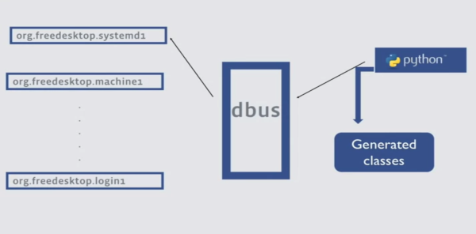

name: default
layout: true

class: center, middle
count: false
---
name: left
layout: true

class: left, middle
count: false
---
template: default


## Python, systemd i journald: lecimy XD

### Pykonik #40

2018-11-22<br>
Maciej Lasyk

---
template: default

# agenda

.left[
- intro to systemd
- services & unit files
- templates
- journal / logging
- nspawn containers
- portable services
- socket activation
- dbus
- sd-notify
- demos
]

---
template: default

# systemd - what is that?

---
template: default

#### Linux startup:
.left[
- BIOS etc (hardware related stuff)
- boot loader (BIOS w/MBR, UEFI no need for boot loader: Kernel loader direct exec)
   - LILO (remember?), GRUB 1 & 2, SYS/ISOLINUX etc
- Kernel loading
   - loading stage: load compressed Kernel into mem and decompress
   - startup stage: detect hardware, load init system and setup user - space and go idle
- init system goes in (systemd here)
]

---
template: default

# systemd - learning

```bash
man systemd.index

[...]
This index contains 691 entries, referring to 245 individual manual pages.
```

--

See what's more:
```bash
man systemd[TAB][TAB]
```
--

.left[
- [systemd for developers I](http://0pointer.de/blog/projects/socket-activation.html)
- [systemd for developers II](http://0pointer.de/blog/projects/socket-activation2.html)
- [systemd for developers III](http://0pointer.de/blog/projects/journal-submit.html)
]

---
template: default

# systemd-bin
---
template: default

#### systemd-bin
# systemctl

For dealing with unit files, services, targets etc we use **systemctl**

---
template: default

#### systemd-bin
# systemctl

.left[
```bash`
- man systemctl
- What's happening on my system? `systemctl status`
- Show me loaded services: `systemctl -t service`
- Show me all unit files: `systemctl list-unit-files`
- Set vendors default (enable / disable): `systemctl preset docker`
- What's my system's current state? `systemctl is-system-running`
- Which units are in failed state? `systemctl --failed`
- Plz show me dependencies of httpd: `systemctl list-dependencies docker`
- `systemctl enable --now docker`
- `sytemctl disable --now docker`
- `systemctl show docker`
```]
---
template: default

#### systemd-bin
# analyzing boot process

With systemd analyzing boot process looks quite interesting<br>
(demo, pictures!):

--

.left[
```bash
systemd-analyze time
systemd-analyze blame
systemd-analyze plot > boot.svg 
systemd-analyze dump
systemd-analyze verify system.slice
systemd-analyze dot 'docker.*' | dot -Tsvg > docker.svg
systemd-analyze dot --to-pattern='*.target' --from-pattern='*.target' | \`
dot -Tsvg > targets.svg
```]

---
template: default

#### systemd-bin
# process confinement

You may run any process under systemd / cgroups confinement:

--

.left[
```bash
- `systemd-run env`
- `systemd-run --unit=test_run env`
- `systemd-run -p BlockIOWeight=10 updatedb`
- Timers:
    - `date; systemd-run --on-active=20 --timer-property=AccuracySec=100ms \
       /bin/touch /tmp/foo`
    - `journalctl -b -u run-71.timer`
    
    `--on-active=, --on-boot=, --on-startup=` 
    `--on-unit-active=, --on-unit-inactive=`
```]

---
template: default

#### systemd-bin
# and many more

.left[
- systemd-cgtop
- systemctl kill
- man systemd.kill
- systemd-path
- man file-hierarchy
- systemd-detect-virt
- timedatectl
- man systemd-[TAB][TAB]
]

---
template: default

# services & unit files
---
template: default

#### services & unit files
# imperativeness vs declarativeness

compare httpd init script vs unit file
---
template: default

#### services & unit files
# types of units

--

service

target

path

timer

socket

...


```bash
man systemd.(device|mount|automount|swap|slice|scope)
man systemd.unit

```

---
template: default

#### services & unit files
# runlevels & targets

Before systemd we had runlevels (remember? chkconfig && 2,3,5?). Now we have
units of type **target**. Think of targets as **unit aggregators / groups**

.left[
```bash
- A bit of documentation: `man systemd.target`
- Display possible targets: `systemctl list-units --type=target`
- Which is default (current runlevel)? `systemctl get-default`
- Wanna change default target (runlevel)? `systemctl isolate [target]` / AllowIsolate=
- `systemctl isolate multi-user.target` (or) `systemctl isolate runlevel3.target`
- `systemctl isolate graphical.target` (or) `systemctl isolate runlevel5.target`
```]

```bash
man systemd.target
```

---
template: default

#### services & unit files
# services dependencies

   Requires, Requisite, Wants, BindsTo, PartOf, Conflicts, Before,
   After, OnFailure, PropagatesReloadTo, ReloadPropagatedFrom,
   StopWhenUnneeded, DefaultDependencies, WantedBy, RequiredBy, Also
   
```bash
man systemd.unit
man systemd.service
man systemd.directives
```
---
template: default

#### services & unit files
# cronjobs / timers

systemctl list-timers (--all)

monotonic vs realtime

.left[
```bash
[Unit]
Description=Run script every hour

[Timer]
OnBootSec=10min
OnUnitActiveSec=1h
Unit=script.service

[Install]
WantedBy=multi-user.target
```]

```bash
man systemd.time
man systemd.timer
man timedatectl
```

---
template: default

#### services & unit files
# cgroups control

   CPUShares, CPUAccounting, MemoryAccounting, MemoryLimit,
   BlockIOAccounting, BlockIOWeight, BlockIOReadBandwidth,
   BlockIOWriteBandwidth

```bash
man systemd.resource-control
```
---
template: default

#### services & unit files
# defining kill method

systemctl kill

KillMode, KillSignal, SendSIGHUP, SendSIGKILL

```bash
man systemd.kill
```
---
template: default

# templates

.left[
```bash
/etc/systemd/system/app@.service
[Unit]
Description=service description with param %i

[Service]
User=someuser
ExecStart=/home/joe/bin/service -cfg %i.cfg
```
]

```bash
man systemd.unit
```

---
template: default

# journal & logging

journald resolves security in syslog (authentication)

no more "disk is out of space" due to growing logs

built-in anti d-dos (rate - limiter)

---
template: default

#### journal & logging
# basic filtering
.left[
```bash
journalctl:
recently: -e, last 4 entries: -n 40, reverse: -r, kernel related: -k,
since last boot: -b, no-paging: --no-pager, live tailing: -f
```]

--

# severity filtering:
.left[
```bash
logs severity: -p err, range? -p info..err
    - emerg(0), alert(1), crit(2), err(3), warning(4), notice(5), info(6), debug(7)
```]

---
template: default

#### journal & logging
# output formatting
.left[
```bash
journalctl -o json
journalctl -o json-pretty
short, verbose, export, json, cat
```
]

--

# time filtering
.left[
```bash
man systemd.time
journalctl --since="2016-08-01"
journalctl --until="2016-09-01"
Timezone? default local, but you may add definition, e.g. UTC
    journalctl --since="2016-11-26 07:00:00 UTC"
today, yesterday, tomorrow, -1week, -1month, -20day - see docs
```]
---
template: default

#### journal & logging
# grepping

Simply remember to filter first!

```bash
journalctl -b -u some.service --no-pager | grep -i 'some_keyword'
```

```bash
man man systemd.timer
man journalctl

```
---

template: default

#### journal & logging
# metadata

.left[
```bash
Show detailed metadata: `journalctl -o verbose`
> `journalctl -F [TAB]`
> `man systemd.directives`
Specific PID: `journalctl _PID=1`
Could provide more than one: `journalctl _PID=1 _PID=123`
> `journalctl -F _SYSTEMD_UNIT`
> `journalctl _SE[TAB]`
Filter by hostname: `journalctl _HOSTNAME=somehost`
> `journalctl _UID=x GID=y`
Add more contextual info: `journalctl -x` - (info app - defined)
```]

```bash
man systemd.journal-fields
```
---
template: default

# nspawn containers

.left[
- containers built into the systemd
- no daemon behind
- no need to do anything with storage or network
- quite low - level w/higher entry barrier than Docker
]

```bash
man systemd.nspawn
```
---
template: default

#### nspawn containers

.left[
```bash
dnf --releasever=25 --installroot=/var/lib/machines/f25-systemd-demo
   install systemd passwd dnf fedora-release 
systemd-nspawn -D /var/lib/machines/f25-systemd-demo
passwd
cp /usr/lib/systemd/system/systemd-nspawn\@.service
   /etc/systemd/system/systemd-nspawn@f25-systemd-demo.service
systemctl daemon-reload
systemctl enable --now systemd-nspawn@f25-systemd-demo.service
machinectl
machinectl login/shell f25-systemd-demo
```]

--

### machinectl

---
template: default

# portable services

.left[
- not containers
- standard system services run in a confinement
- shared environment (e.g. network) w/host
- can be resource - limited
- see: https://media.ccc.de/v/ASG2018-200-portable_services_are_ready_to_use
- from SD v.239
]

---
template: default

# portable services

.left[
```bash
portablectl
  attach foobar.raw
    # picks service files from the image
    # foobar*.(service|socket|target|path|timer)
    # copies into hsots /etc/systemd/system
    # extends w/RootDirectory (or DiskImage)
    # creates DynamicUsers
  enable / disable / start / stop / status
  detach
    # removes unit files
    # leaves logs in journal
    # removes DynamicUsers
  list
  set-limit - for setting up quota
```
]

see walkthrough: http://0pointer.net/blog/walkthrough-for-portable-services.html

see how FB uses systemd @fb scale: https://media.ccc.de/v/ASG2018-192-state_of_systemd_facebook (they are very interested in portable services now)

---
template: default

#### services & unit files
# socket activation

usable e.g. for starting your dev environment

    ListenStream, ListenDatagram, ListenSequentialPacket, ListenFifo,
    ListenSpecial, ListenNetlink, ListenMessageQueue, ListenUSBFunction,
    SocketProtocol, BindToDevice...

Zero downtime deployment w/systemd & Python?

https://youtu.be/_OLwb8zV9r4

```bash
man systemd-socket-activate.html
man systemd.socket
man systemd.service
```
    
---
template: default

#### services & unit files
# socket activation


.left[
```bash
app.socket
[Unit]
Description=Socket activation for simple systemd-notify app

[Socket]
ListenStream=1025

[Install]
WantedBy=sockets.target

app.service
[Unit]
Description=some app

[Service]
User=joe
ExecStart=/home/joe/bin/app
```]

---
template: default

#### systemd-bin
# dbus

So systemd uses DBus for IPC (inter - process communication, messaging system).

External services use Dbus to communicate w/systemd

.left[
```bash
- see current state of procs registered in bus: `busctl`
- more info: https://freedesktop.org/wiki/Software/dbus/
- `sudo busctl capture > test.pcap` + wireshark
- `busctl tree`
```]

---
template: default

#### Cython

.left[
- Python compiles -> C -> byte code
- Python with C/C++ data types
- integrate native code into Python
- write C/C++ without writing in C/C++
]

--

cython demo (-a):

```bash
mkvirtualenv demo-1-cython
pip install -r notebook demos/requirements.txt
jupyter notebook demos/demo-1-cython.ipynb
```


---
template: default

#### Python & systemd

Systemd is written in C

.left[
- python-systemd
  - https://github.com/systemd/python-systemd
  - **2 years w/out updates**
  - packaged w/e.g. Fedora
  - using extension modules for calling C library functions
  - see https://docs.python.org/2/extending/extending.html
- sdnotify
  - https://github.com/bb4242/sdnotify
  - **rather obsolete**
- cysystemd: https://github.com/mosquito/cysystemd
- pystemd: https://github.com/facebookincubator/pystemd
]

---
template: default

#### cysystemd

.left[
- 1 contributor (3 in total)
- Python wrapper for systemd
  - imports directly from sd_* C libraries
  - see: https://github.com/mosquito/cysystemd/blob/master/cysystemd/sd_journal.pxd
  - possible implications? changes in C libraries
- https://github.com/mosquito/cysystemd/
- provides sd-notify, journal read/write
- I use it for developing services (servers, daemons, processing etc)
]


---
template: default

#### Pystemd

.left[
- Created in Facebook incubator  and used on their production
- Communicates w/systemd via systemd interfaces exposed in DBus
- provides ... and many more easily to be added via DBus interfaces
- https://media.ccc.de/v/ASG2018-194-using_systemd_to_high_level_languages - see
  for advanced usages and the whole story behind
- I use it to manage services on server
]

---
template: default



---
template: default

#### demo 2: cystemd - working with journal/logging

.left[
```bash
# workon pykonik (install libs from shared requirements.txt)
cd demo-2-cysystemd-journal
python ...
```
]

---
template: default

#### demo 3: cystemd - self - healing w/sd-notify

.left[
```bash
cd demo-3-cysystemd-sd-notify
sudo cp *.service /etc/systemd/system/
# sudo systemctl start/stop <above_service> 
# and observe journalctl entries and service status
python ...
```
]

---
template: default

#### demo 4: pystemd - managing services

.left[
```bash
cd demo-4-pystemd
sudo cp *.service /etc/systemd/system/
# sudo systemctl start/stop <above_service> 
# and observe journalctl entries and service status
jupyter notebook demos/demo-4-pystemd.ipynb
```
]

---
template: default

#### demo 5: pystemd-run - running transient services and resources control

see **demo-5-pystemd-run-resources-control/pystemd-run.txt**

more here: https://github.com/facebookincubator/pystemd/blob/master/_docs/pystemd.run.md

---
template: default

# #learningsystemd

man systemd.index

https://www.freedesktop.org/wiki/Software/systemd/

http://0pointer.de/blog/projects/ (look 4 systemd*)

http://0pointer.de/blog/projects/the-biggest-myths.html

http://maciej.lasyk.info/tag/learning-systemd.html

SODO meetup: https://www.youtube.com/watch?v=rZgVXImr0uc
---
template: default


# Thanks, Q&A?

### Maciej Lasyk

@docent-net<br>
[https://maciej.lasyk.info/slides/2018-pykonik-40-python-systemd/](https://maciej.lasyk.info/slides/2018-pykonik-40-python-systemd/)