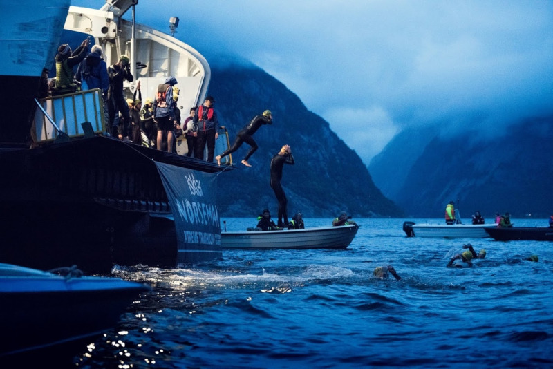
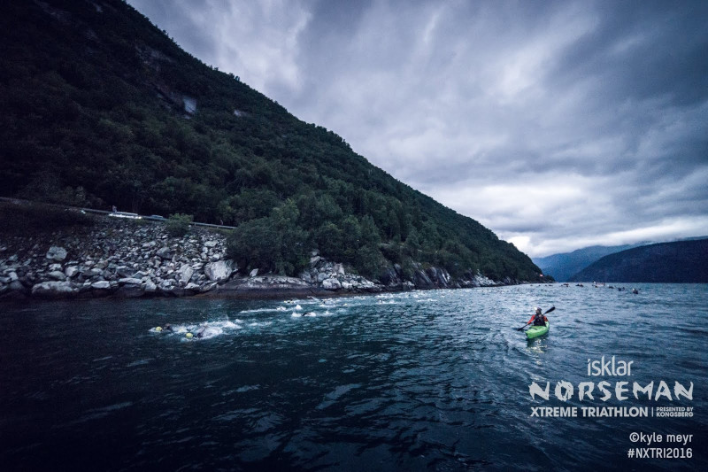
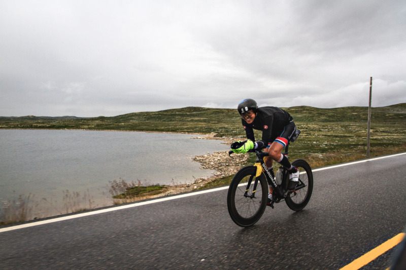
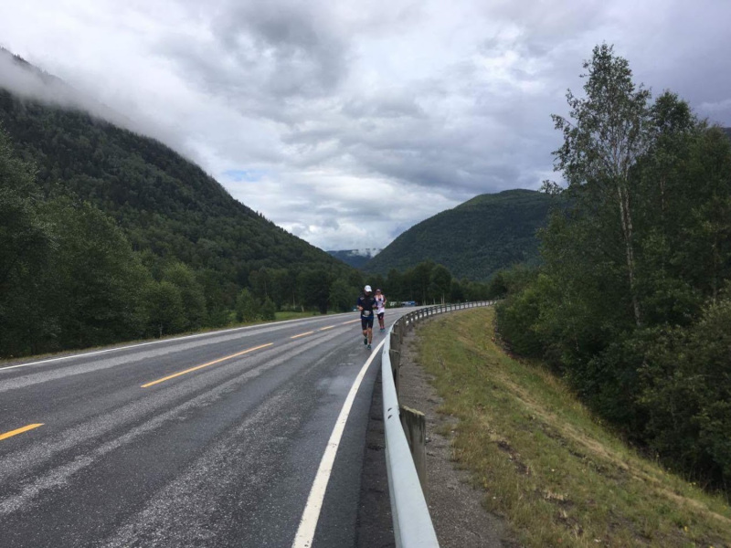
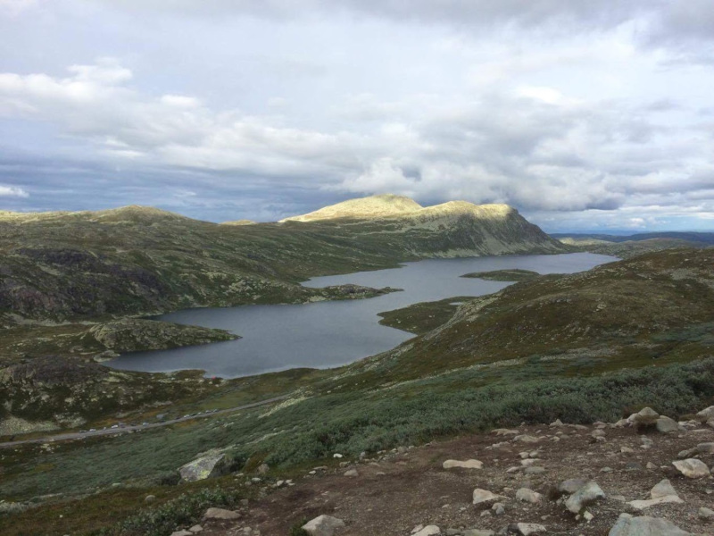
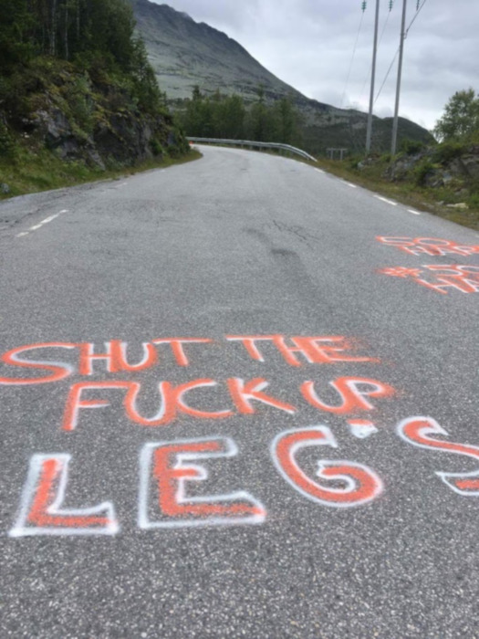
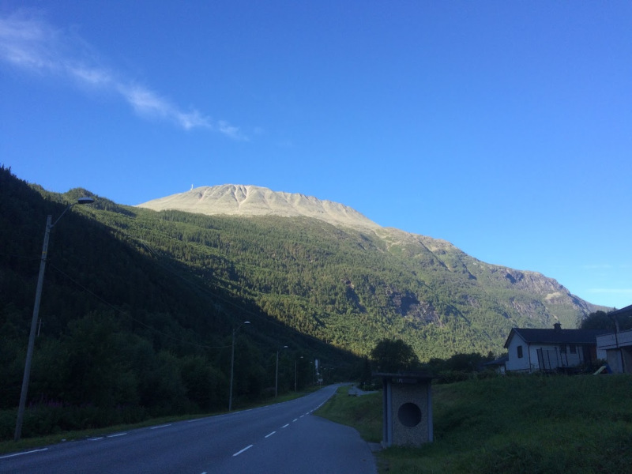
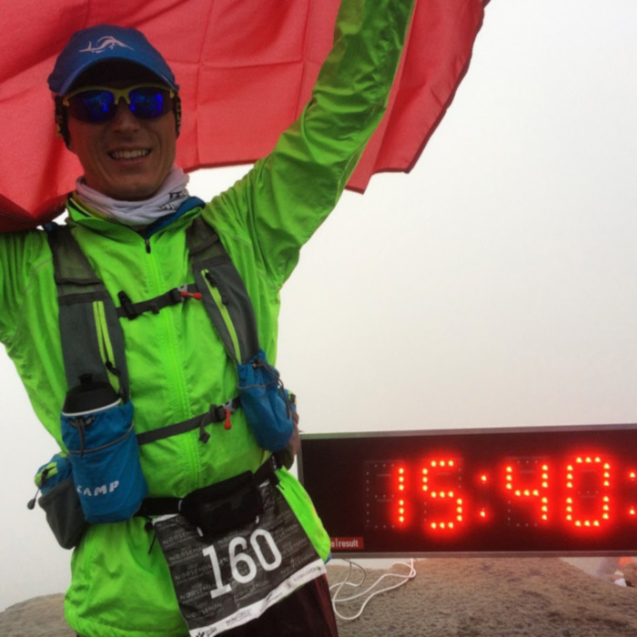
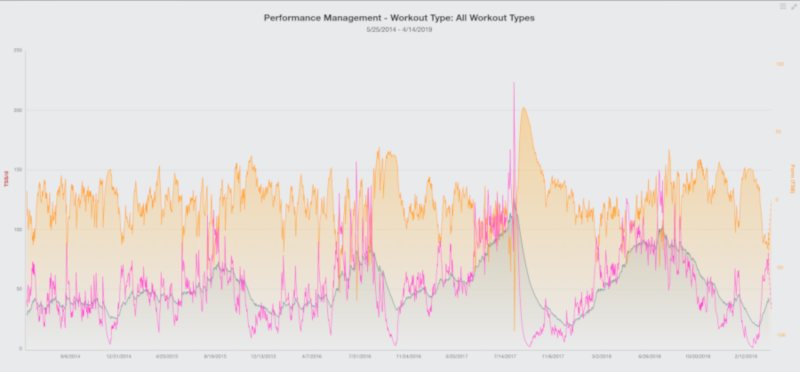
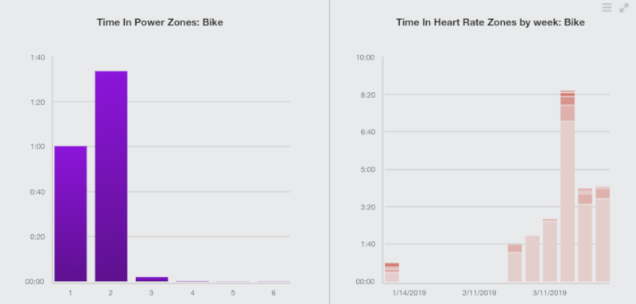

name: default
layout: true

class: center, middle
count: false
---
name: left
layout: true

class: left, middle
count: false
---
template: left

# sshuttle

```bash
man sshuttle

sshuttle  allows you to create a VPN connection from your machine to 
any remote server that you can connect to via ssh, as long as that 
server has python 2.3 or higher.
```

--

```bash
To work, you must have root access on the local machine, but you can 
have a normal account on the server.
```

--

```bash
It's valid to run sshuttle more than once simultaneously on a single 
client machine, connecting to a different server every time, so you 
can be on more than one VPN at once.
```

--

```bash
If run on a router, sshuttle can forward traffic for your entire subnet 
to the VPN.
```

---
template: left

# sshuttle

```bash
After connecting to the remote server, sshuttle uploads its (python) 
source code to the remote end  and executes it there.  Thus, you don't 
need to install sshuttle on the remote server, and there are never 
sshuttle version conflicts between client and server.
```

--

```bash
Unlike most VPNs, sshuttle forwards sessions, not packets.  That is, 
it uses kernel transparent proxying  (iptables  REDIRECT  rules  on  
Linux) to capture outgoing TCP sessions, then creates entirely separate 
TCP sessions out to the original destination at the other end of the tunnel.
```

---
template: left

# sshuttle

```bash
~ sshuttle -r netrunner 192.168.1.10/32
[local sudo] Password:
client: Connected
```

--

```bash
~ sshuttle -r netrunner 192.168.1.0/24
[local sudo] Password:
client: Connected
```

--

```bash
Chain sshuttle-12300 (2 references)
target     prot opt source               destination
RETURN     tcp  --  anywhere             localhost
REDIRECT   tcp  --  anywhere             git.netrunner.lasyk.info  TTL match \ 
    TTL != 42 redir ports 12300
```

---
template: default


### Teza:

--

### To juz jest rok Linuksa na desktopie!

--

### (laptopie)

--

### (i był już kilka lat temu)

---
template: default


## O sporcie, video i<br>
## podcastach w Linuksie

---
template: default



---

template: default


---

template: default



---

template: default


---

template: default


---

template: default



---

template: default



---

template: default



---

template: default



---

template: default



---

template: default



---

template: left

# Metody treningowe i analiza

.left[
- Książki - tony
- Włąsne doświadczenia i wiele błędów
- "Trening nie musi zostać odbyty aka trenuj mądrze"
- Podejście "data driven"
- Jakie metryki? Jakie zakresy treningowe (tętno, moc)
- Jak opisać trening liczbami?
- GoldenCheetah!
]

---

template: default



---

template: default



---

template: left

# Pływanie

.left[
- Swim Smooth
- Technika najważniejsza
- Analiza video
- Blender!
]

---

template: left

# Podcasty

.left[
- Jak opowiedzieć historię w 2019 roku?
- RSS / blogpost?
- Podcast :O
- Audacity!
]

---
template: default


## O sporcie, video i<br>
## podcastach w Linuksie

.left[
- https://maciej.lasyk.info
- https://dlugodystansowy.pl
]


2019-04-07<br>
Maciej Lasyk

